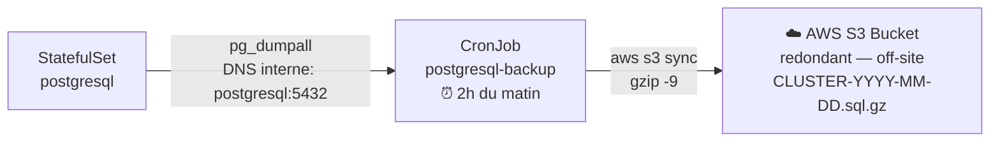

# Environnement : cloud/aws (EKS)

Déploiement de la stack IAM sur Amazon Elastic Kubernetes Service (EKS).

---

## Sommaire

- [Prérequis](#prérequis)
  - [Outils à installer sur le poste local](#outils-à-installer-sur-le-poste-local)
  - [Ressources AWS nécessaires](#ressources-aws-nécessaires)
- [1 — Créer le cluster EKS](#1-créer-le-cluster-eks)
- [2 — Installer le CSI driver EBS (StorageClass gp2)](#2-installer-le-csi-driver-ebs-storageclass-gp2)
- [3 — Récupérer l'IP/DNS du Load Balancer](#3-récupérer-lipdns-du-load-balancer)
- [4 — Configurer le DNS](#4-configurer-le-dns)
    - [Option A — Route 53 (recommandé)](#option-a-route-53-recommandé)
    - [Option B — Registrar externe](#option-b-registrar-externe)
- [5 — Configurer le hostname](#5-configurer-le-hostname)
- [6 — Créer les secrets Kubernetes](#6-créer-les-secrets-kubernetes)
- [7 — Déployer](#7-déployer)
- [8 — Accès](#8-accès)
- [StorageClass AWS](#storageclass-aws)
- [Opérations courantes](#opérations-courantes)
- [Réinitialisation](#réinitialisation)
- [Sauvegardes PostgreSQL](#sauvegardes-postgresql)
- [Supprimer le cluster EKS](#supprimer-le-cluster-eks)

---


## Prérequis

### Outils à installer sur le poste local

```bash
# AWS CLI
curl "https://awscli.amazonaws.com/awscli-exe-linux-x86_64.zip" -o "awscliv2.zip"
unzip awscliv2.zip && sudo ./aws/install
aws --version

# eksctl (outil de création de cluster EKS)
curl --silent --location "https://github.com/weaveworks/eksctl/releases/latest/download/eksctl_$(uname -s)_amd64.tar.gz" | tar xz -C /tmp
sudo mv /tmp/eksctl /usr/local/bin
eksctl version

# kubectl
curl -LO "https://dl.k8s.io/release/$(curl -L -s https://dl.k8s.io/release/stable.txt)/bin/linux/amd64/kubectl"
sudo install -o root -g root -m 0755 kubectl /usr/local/bin/kubectl

# Configurer les credentials AWS
aws configure
# AWS Access Key ID, Secret Access Key, region (ex: eu-west-1)
```

### Ressources AWS nécessaires

- Un compte AWS avec les droits IAM pour créer un cluster EKS
- Un nom de domaine (Route 53 ou registrar externe)

---

## 1 — Créer le cluster EKS

```bash
# Variables à adapter
CLUSTER_NAME="iam-cluster"
REGION="eu-west-1"
NODE_TYPE="t3.medium"

# Créer le cluster (10-15 minutes)
eksctl create cluster \
  --name "$CLUSTER_NAME" \
  --region "$REGION" \
  --node-type "$NODE_TYPE" \
  --nodes 2 \
  --nodes-min 1 \
  --nodes-max 3 \
  --managed

# Vérifier la connexion
kubectl get nodes
```

La commande `eksctl create cluster` configure automatiquement `~/.kube/config`.

---

## 2 — Installer le CSI driver EBS (StorageClass gp2)

Sur EKS, la StorageClass `gp2` nécessite le driver EBS CSI :

```bash
# Activer le driver EBS CSI via addon EKS
eksctl create addon \
  --name aws-ebs-csi-driver \
  --cluster "$CLUSTER_NAME" \
  --region "$REGION" \
  --force

# Vérifier que la StorageClass gp2 est disponible
kubectl get storageclass
```

---

## 3 — Récupérer l'IP/DNS du Load Balancer

Après le déploiement (étape 6), Traefik crée un service `LoadBalancer` qui reçoit un hostname ELB :

```bash
kubectl get svc -n iam-system traefik
# EXTERNAL-IP : hostname ELB (ex: xxx.eu-west-1.elb.amazonaws.com)
```

---

## 4 — Configurer le DNS

#### Option A — Route 53 (recommandé)

```bash
# Créer une hosted zone (si elle n'existe pas)
aws route53 create-hosted-zone \
  --name mondomaine.com \
  --caller-reference $(date +%s)

# Créer un enregistrement CNAME vers l'ELB
# (via console AWS Route 53 ou aws CLI)
```

#### Option B — Registrar externe

Créer un enregistrement CNAME chez ton registrar :

```
keycloak.mondomaine.com  CNAME  xxx.eu-west-1.elb.amazonaws.com
```

Vérifier la propagation :

```bash
nslookup keycloak.mondomaine.com
```

---

## 5 — Configurer le hostname

Remplacer le hostname dans les **3 fichiers** :

```bash
vi environments/cloud/aws/.env
# → KEYCLOAK_HOSTNAME=keycloak.mondomaine.com

vi k8s/overlays/cloud/aws/patches/keycloak-hostname.yaml
# → KEYCLOAK_HOSTNAME: keycloak.mondomaine.com

# Créer le patch Ingress pour AWS
cat > k8s/overlays/cloud/aws/patches/keycloak-ingress.yaml <<EOF
apiVersion: networking.k8s.io/v1
kind: Ingress
metadata:
  name: keycloak
  namespace: iam-system
spec:
  rules:
    - host: keycloak.mondomaine.com
      http:
        paths:
          - path: /
            pathType: Prefix
            backend:
              service:
                name: keycloak
                port:
                  name: http
EOF
```

> Les 3 fichiers doivent avoir exactement la même valeur.

---

## 6 — Créer les secrets Kubernetes

```bash
kubectl create namespace iam-system

kubectl create secret generic pg-password \
  --from-literal=password='VOTRE_MOT_DE_PASSE_PG' -n iam-system

kubectl create secret generic redis-password \
  --from-literal=password='VOTRE_MOT_DE_PASSE_REDIS' -n iam-system

kubectl create secret generic keycloak-admin \
  --from-literal=password='VOTRE_MOT_DE_PASSE_ADMIN_KC' -n iam-system
```

Vérifier :

```bash
kubectl get secrets -n iam-system
```

---

## 7 — Déployer

```bash
./scripts/deploy-infra.sh --env cloud/aws
```

Surveiller le démarrage :

```bash
kubectl get pods -n iam-system -w
```

---

## 8 — Accès

```
http://keycloak.mondomaine.com/admin/
```

Connexion : `admin` / mot de passe du secret `keycloak-admin`

> **Note TLS :** Pour HTTPS avec ACM (AWS Certificate Manager) sur EKS, configurer une annotation sur le service Traefik ou utiliser AWS Load Balancer Controller. La StorageClass `gp2` est déjà configurée dans l'overlay AWS.

---

## StorageClass AWS

L'overlay `cloud/aws` configure automatiquement la StorageClass `gp2` (EBS General Purpose SSD) pour PostgreSQL et Redis. Aucune action supplémentaire n'est nécessaire après l'installation du driver EBS CSI (étape 2).

```bash
# Vérifier les volumes persistants
kubectl get pvc -n iam-system
```

---

## Opérations courantes

```bash
# État des pods
kubectl get pods -n iam-system

# Redémarrer tous les services
./scripts/restart-infra.sh --env cloud/aws

# Logs par service
kubectl logs -n iam-system deployment/traefik -f
kubectl logs -n iam-system statefulset/postgresql -f
kubectl logs -n iam-system deployment/redis -f
kubectl logs -n iam-system deployment/keycloak -f
```

---

## Réinitialisation

```bash
# Reset en conservant les données
./scripts/reset-infra.sh --env cloud/aws --keep-data
./scripts/deploy-infra.sh --env cloud/aws

# Reset complet
./scripts/reset-infra.sh --env cloud/aws
# → Recréer les secrets (voir étape 6) puis redéployer
```

---

## Sauvegardes PostgreSQL

### Contexte EKS — pourquoi pas hostPath ?

Sur EKS, le cluster est multi-nœuds. Un `hostPath` monterait le répertoire d'un nœud
**aléatoire** à chaque exécution du CronJob : les fichiers seraient dispersés sur plusieurs
instances EC2 et impossibles à retrouver. Cette approche est donc incompatible avec EKS.

### Step 2 — AWS S3 (planifiée)

Le CronJob de backup sera étendu pour écrire directement dans un **bucket AWS S3** via
`aws s3 sync`. Le stockage S3 est redondant, versionnant (avec lifecycle policies) et
accessible indépendamment du cycle de vie du cluster.



**Ce qu'il faudra implémenter :**
- Créer un bucket S3 dédié aux backups avec versioning activé
- Créer un IAM Role avec permissions `s3:PutObject` sur ce bucket
- Associer le Role au ServiceAccount du CronJob (IRSA — IAM Roles for Service Accounts)
- Étendre le CronJob pour uploader via `aws s3 sync`
- Configurer une lifecycle policy S3 pour la rétention (ex: 30 jours)

Cette étape sera implémentée dans une PR dédiée.

---

## Supprimer le cluster EKS

```bash
eksctl delete cluster \
  --name "$CLUSTER_NAME" \
  --region "$REGION"
```

> Cela supprime le cluster, les nœuds EC2 et les volumes EBS. Les données sont perdues définitivement.
