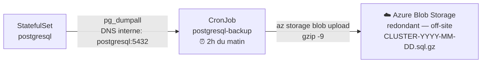

# Environnement : cloud/azure (AKS)

Déploiement de la stack IAM sur Azure Kubernetes Service (AKS).

---

## Sommaire

- [Prérequis](#prérequis)
  - [Outils à installer sur le poste local](#outils-à-installer-sur-le-poste-local)
  - [Ressources Azure nécessaires](#ressources-azure-nécessaires)
- [1 — Créer le cluster AKS](#1-créer-le-cluster-aks)
- [2 — Récupérer l'IP publique du Load Balancer](#2-récupérer-lip-publique-du-load-balancer)
- [3 — Configurer le DNS](#3-configurer-le-dns)
- [4 — Configurer le hostname](#4-configurer-le-hostname)
- [5 — Configurer les secrets (Infisical + ESO)](#5-configurer-les-secrets-infisical--eso)
- [6 — Déployer](#6-déployer)
- [7 — Accès](#7-accès)
- [StorageClass Azure](#storageclass-azure)
- [Opérations courantes](#opérations-courantes)
- [Réinitialisation](#réinitialisation)
- [Sauvegardes PostgreSQL](#sauvegardes-postgresql)
- [Supprimer le cluster AKS](#supprimer-le-cluster-aks)

---


## Prérequis

### Outils à installer sur le poste local

```bash
# Azure CLI
curl -sL https://aka.ms/InstallAzureCLIDeb | sudo bash
az version

# kubectl
az aks install-cli

# Se connecter à Azure
az login
```

### Ressources Azure nécessaires

- Un abonnement Azure actif
- Un groupe de ressources
- Un nom de domaine ou une IP publique pour Keycloak (Load Balancer AKS)

---

## 1 — Créer le cluster AKS

```bash
# Variables à adapter
RESOURCE_GROUP="mon-rg"
CLUSTER_NAME="iam-cluster"
LOCATION="westeurope"

# Créer le groupe de ressources
az group create --name "$RESOURCE_GROUP" --location "$LOCATION"

# Créer le cluster AKS (2 nœuds minimum)
az aks create \
  --resource-group "$RESOURCE_GROUP" \
  --name "$CLUSTER_NAME" \
  --node-count 2 \
  --node-vm-size Standard_B2s \
  --enable-managed-identity \
  --generate-ssh-keys

# Récupérer la configuration kubectl
az aks get-credentials \
  --resource-group "$RESOURCE_GROUP" \
  --name "$CLUSTER_NAME"

# Vérifier la connexion au cluster
kubectl get nodes
```

---

## 2 — Récupérer l'IP publique du Load Balancer

Après le déploiement (étape 5), Traefik crée un service `LoadBalancer` qui reçoit une IP publique Azure.

```bash
kubectl get svc -n iam-system traefik
# EXTERNAL-IP : l'IP publique Azure assignée
```

---

## 3 — Configurer le DNS

Chez ton registrar, créer un enregistrement A :

```
keycloak.mondomaine.com  →  EXTERNAL-IP du LoadBalancer
```

Ou utiliser l'IP publique Azure avec un domaine Azure :

```bash
# Associer un DNS label à l'IP publique du LoadBalancer
az network public-ip update \
  --resource-group MC_${RESOURCE_GROUP}_${CLUSTER_NAME}_${LOCATION} \
  --name <nom-ip-publique> \
  --dns-name keycloak-iam
# → keycloak-iam.westeurope.cloudapp.azure.com
```

---

## 4 — Configurer le hostname

Remplacer le hostname dans les **3 fichiers** :

```bash
vi environments/cloud/azure/.env
# → KEYCLOAK_HOSTNAME=keycloak.mondomaine.com

vi k8s/overlays/cloud/azure/patches/keycloak-hostname.yaml
# → KEYCLOAK_HOSTNAME: keycloak.mondomaine.com

# Créer le patch Ingress pour Azure (non fourni par défaut)
cat > k8s/overlays/cloud/azure/patches/keycloak-ingress.yaml <<EOF
apiVersion: networking.k8s.io/v1
kind: Ingress
metadata:
  name: keycloak
  namespace: iam-system
spec:
  rules:
    - host: keycloak.mondomaine.com
      http:
        paths:
          - path: /
            pathType: Prefix
            backend:
              service:
                name: keycloak
                port:
                  name: http
EOF
```

> Les 3 fichiers doivent avoir exactement la même valeur.

---

## 5 — Configurer les secrets (Infisical + ESO)

Les secrets applicatifs sont gérés via **Infisical + ESO** — jamais dans des fichiers locaux.
Voir [docs/reference/secrets-management.md](../reference/secrets-management.md) pour la doc complète.

### 5.1 — Prérequis Infisical (une seule fois, hors cluster)

1. Créer un compte sur [app.infisical.com](https://app.infisical.com) (tier gratuit suffisant)
2. Créer un projet nommé `swarm-iam-platform` (ou réutiliser le projet existant)
3. Dans ce projet, créer l'environnement `prod-azure`
4. Ajouter les secrets suivants dans l'environnement `prod-azure` :

| Clé Infisical | Valeur |
|---|---|
| `PG_PASSWORD` | Mot de passe PostgreSQL |
| `REDIS_PASSWORD` | Mot de passe Redis |
| `KEYCLOAK_ADMIN_PASSWORD` | Mot de passe admin Keycloak |

5. Créer un **Machine Identity** (Universal Auth) avec accès en lecture au projet
6. Noter le `Client ID` et le `Client Secret` générés

### 5.2 — Renseigner les credentials dans `.env`

```bash
vi environments/cloud/azure/.env
```

```bash
INFISICAL_CLIENT_ID=<CLIENT_ID_DU_MACHINE_IDENTITY>
INFISICAL_CLIENT_SECRET=<CLIENT_SECRET_DU_MACHINE_IDENTITY>
```

### 5.3 — Installer ESO sur le cluster (une seule fois)

```bash
./scripts/setup-eso.sh
```

### 5.4 — Créer le secret bootstrap Infisical

```bash
./secrets/setup-infisical.sh --env cloud/azure
```

> À partir de ce point, tous les Kubernetes Secrets sont créés **automatiquement**
> par ESO au moment du déploiement (étape 6).

---

## 6 — Déployer

```bash
./scripts/deploy-infra.sh --env cloud/azure
```

Surveiller le démarrage :

```bash
kubectl get pods -n iam-system -w
```

---

## 7 — Accès

```
http://keycloak.mondomaine.com/admin/
```

Connexion : `admin` / mot de passe du secret `keycloak-admin`

> **Note TLS :** Pour HTTPS avec Let's Encrypt sur AKS, installer cert-manager et configurer un ClusterIssuer. La StorageClass `managed-csi` est déjà configurée dans l'overlay Azure.

---

## StorageClass Azure

L'overlay `cloud/azure` configure automatiquement la StorageClass `managed-csi` (Azure Disk) pour PostgreSQL et Redis. Aucune action supplémentaire n'est nécessaire.

```bash
# Vérifier les volumes persistants
kubectl get pvc -n iam-system
```

---

## Opérations courantes

```bash
# État des pods
kubectl get pods -n iam-system

# Redémarrer tous les services
./scripts/restart-infra.sh --env cloud/azure

# Logs par service
kubectl logs -n iam-system deployment/traefik -f
kubectl logs -n iam-system statefulset/postgresql -f
kubectl logs -n iam-system deployment/redis -f
kubectl logs -n iam-system deployment/keycloak -f
```

---

## Réinitialisation

```bash
# Reset en conservant les données
./scripts/reset-infra.sh --env cloud/azure --keep-data
./scripts/deploy-infra.sh --env cloud/azure

# Reset complet
./scripts/reset-infra.sh --env cloud/azure
# → Recréer les secrets (voir étape 5) puis redéployer
```

---

## Sauvegardes PostgreSQL

### Contexte AKS — pourquoi pas hostPath ?

Sur AKS, le cluster est multi-nœuds. Un `hostPath` monterait le répertoire d'un nœud
**aléatoire** à chaque exécution du CronJob : les fichiers seraient dispersés sur plusieurs
machines et impossibles à retrouver. Cette approche est donc incompatible avec AKS.

### Step 2 — Azure Blob Storage (planifiée)

Le CronJob de backup sera étendu pour écrire directement dans **Azure Blob Storage** via
`az storage blob upload`. Le stockage managé Azure est redondant, versionnant et accessible
indépendamment du cycle de vie du cluster.



**Ce qu'il faudra implémenter :**
- Créer un Storage Account et un container Blob dédié aux backups
- Ajouter les credentials Azure dans un Secret Kubernetes (`az-backup-credentials`)
- Étendre le CronJob pour uploader via `az storage blob upload`
- Configurer la rétention (lifecycle policy Blob Storage)

Cette étape sera implémentée dans une PR dédiée.

---

## Supprimer le cluster AKS

```bash
az aks delete \
  --resource-group "$RESOURCE_GROUP" \
  --name "$CLUSTER_NAME" \
  --yes --no-wait
```

> Cela supprime le cluster et toutes les données. Les volumes Azure Disk sont supprimés avec le cluster.
