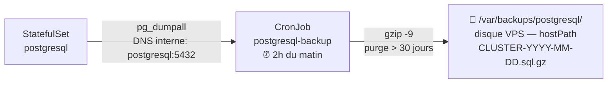
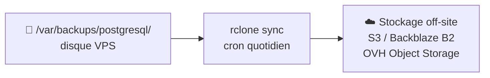

# Environnement : linux-server (VPS bare metal)

Déploiement de la stack IAM sur un serveur Linux dédié ou VPS (Hetzner, OVH, Scaleway…)
avec k3s en mode single-node.

---

## Sommaire

- [Prérequis](#prérequis)
  - [Serveur](#serveur)
  - [Poste local](#poste-local)
- [1 — Configurer le DNS](#1-configurer-le-dns)
- [2 — Installer k3s sur le serveur](#2-installer-k3s-sur-le-serveur)
- [3 — Configurer kubectl en local](#3-configurer-kubectl-en-local)
- [4 — Configurer le hostname](#4-configurer-le-hostname)
- [5 — Créer les secrets Kubernetes](#5-créer-les-secrets-kubernetes)
- [6 — Déployer](#6-déployer)
- [7 — Accès](#7-accès)
- [Opérations courantes](#opérations-courantes)
  - [État des pods](#état-des-pods)
  - [Redémarrer tous les services](#redémarrer-tous-les-services)
  - [Logs par service](#logs-par-service)
  - [Ouvrir un shell dans un pod](#ouvrir-un-shell-dans-un-pod)
- [Réinitialisation](#réinitialisation)
  - [Reset en conservant les données (recommandé)](#reset-en-conservant-les-données-recommandé)
  - [Reset complet (supprime toutes les données)](#reset-complet-supprime-toutes-les-données)
- [Sauvegardes PostgreSQL](#sauvegardes-postgresql)
  - [Architecture Step 1 — CronJob k8s (implémentée)](#architecture--step-1--cronjob-k8s-implémentée)
  - [Backup manuel ponctuel](#backup-manuel-ponctuel)
  - [Restauration depuis un backup daily](#restauration-depuis-un-backup-daily)
  - [Restauration d'une base unique](#restauration-dune-base-unique)
  - [Architecture Step 2 — off-site (planifiée)](#architecture--step-2--off-site-planifiée)

---


## Prérequis

### Serveur

| Ressource | Minimum | Recommandé |
|-----------|---------|------------|
| vCPU      | 2       | 4          |
| RAM       | 2 GB    | 4 GB       |
| Disque    | 20 GB   | 40 GB SSD  |
| OS        | Ubuntu 22.04 LTS | Ubuntu 22.04 LTS |

- Accès SSH avec clé (root ou utilisateur sudo)
- Port 80 et 443 ouverts dans le pare-feu du serveur et du fournisseur
- Un nom de domaine pointant vers l'IP publique du serveur

### Poste local

- `kubectl` installé (`apt install kubectl` ou via snap)
- Accès SSH configuré vers le serveur

---

## 1 — Configurer le DNS

Chez ton registrar ou hébergeur DNS, créer un enregistrement A :

```
keycloak.mondomaine.com  →  IP_PUBLIQUE_DU_SERVEUR
```

Vérifier la propagation DNS (peut prendre quelques minutes) :

```bash
nslookup keycloak.mondomaine.com
# ou
dig keycloak.mondomaine.com +short
```

---

## 2 — Installer k3s sur le serveur

Se connecter en SSH puis exécuter :

```bash
# Désactiver le Traefik intégré (v2.x) — ce projet déploie Traefik v3.1
curl -sfL https://get.k3s.io | INSTALL_K3S_EXEC="--disable=traefik" sh -

# Vérifier que le nœud est Ready
sudo kubectl get nodes
```

Résultat attendu :

```
NAME        STATUS   ROLES                  AGE   VERSION
monserveur  Ready    control-plane,master   1m    v1.x.x+k3s1
```

---

## 3 — Configurer kubectl en local

Récupérer la configuration kubectl depuis le serveur :

```bash
# Sur le serveur
sudo cat /etc/rancher/k3s/k3s.yaml
```

Sur ton poste local :

```bash
mkdir -p ~/.kube

# Copier le contenu dans ~/.kube/config
# Remplacer 127.0.0.1 par l'IP publique du serveur
nano ~/.kube/config

# Vérifier la connexion depuis le poste local
kubectl get nodes
```

---

## 4 — Configurer le hostname

Remplacer `keycloak.example.com` par ton vrai domaine dans les **3 fichiers** suivants :

```bash
# Variables runtime utilisées par les scripts
vi environments/linux-server/.env
# → KEYCLOAK_HOSTNAME=keycloak.mondomaine.com

# Hostname injecté dans le pod Keycloak
vi k8s/overlays/linux-server/patches/keycloak-hostname.yaml
# → KEYCLOAK_HOSTNAME: keycloak.mondomaine.com

# Règle de routage Traefik (Ingress)
vi k8s/overlays/linux-server/patches/keycloak-ingress.yaml
# → host: keycloak.mondomaine.com
```

> Les 3 fichiers doivent avoir exactement la même valeur.

---

## 5 — Créer les secrets Kubernetes

Les secrets ne sont **jamais** dans le dépôt. À créer une seule fois sur le cluster.

```bash
kubectl create namespace iam-system

kubectl create secret generic pg-password \
  --from-literal=password='VOTRE_MOT_DE_PASSE_PG' -n iam-system

kubectl create secret generic redis-password \
  --from-literal=password='VOTRE_MOT_DE_PASSE_REDIS' -n iam-system

kubectl create secret generic keycloak-admin \
  --from-literal=password='VOTRE_MOT_DE_PASSE_ADMIN_KC' -n iam-system
```

Vérifier que les 3 secrets sont présents :

```bash
kubectl get secrets -n iam-system
```

Résultat attendu :

```
NAME             TYPE     DATA   AGE
keycloak-admin   Opaque   1      Xs
pg-password      Opaque   1      Xs
redis-password   Opaque   1      Xs
```

---

## 6 — Déployer

```bash
./scripts/deploy-infra.sh --env linux-server
```

Surveiller le démarrage :

```bash
kubectl get pods -n iam-system -w
```

Tous les pods doivent passer en `1/1 Running`. Keycloak met **60-90 secondes** après PostgreSQL.

Vérifier que Keycloak répond :

```bash
curl -v http://keycloak.mondomaine.com/admin/ 2>&1 | grep -E "HTTP/|Location"
```

---

## 7 — Accès

```
http://keycloak.mondomaine.com/admin/
```

Connexion : `admin` / mot de passe du secret `keycloak-admin`

> **Note TLS :** Le déploiement actuel est en HTTP. Pour activer HTTPS avec un certificat Let's Encrypt, il faut installer cert-manager sur le cluster et configurer un Issuer Traefik. Ceci est hors scope de ce guide.

---

## Opérations courantes

### État des pods

```bash
kubectl get pods -n iam-system
```

### Redémarrer tous les services

```bash
./scripts/restart-infra.sh --env linux-server
```

### Logs par service

```bash
# Traefik
kubectl logs -n iam-system deployment/traefik -f

# PostgreSQL
kubectl logs -n iam-system statefulset/postgresql -f

# Redis
kubectl logs -n iam-system deployment/redis -f

# Keycloak
kubectl logs -n iam-system deployment/keycloak -f
```

### Ouvrir un shell dans un pod

```bash
kubectl exec -it -n iam-system postgresql-0 -- sh
kubectl exec -it -n iam-system deployment/keycloak -- sh
```

---

## Réinitialisation

### Reset en conservant les données (recommandé)

Supprime les déploiements mais conserve les volumes PostgreSQL et Redis.

```bash
./scripts/reset-infra.sh --env linux-server --keep-data
./scripts/deploy-infra.sh --env linux-server
```

### Reset complet (supprime toutes les données)

Supprime le namespace entier **y compris les secrets et les volumes**.

```bash
# 1. Reset
./scripts/reset-infra.sh --env linux-server

# 2. Recréer les secrets
kubectl create namespace iam-system

kubectl create secret generic pg-password \
  --from-literal=password='VOTRE_MOT_DE_PASSE_PG' -n iam-system

kubectl create secret generic redis-password \
  --from-literal=password='VOTRE_MOT_DE_PASSE_REDIS' -n iam-system

kubectl create secret generic keycloak-admin \
  --from-literal=password='VOTRE_MOT_DE_PASSE_ADMIN_KC' -n iam-system

# 3. Vérifier les secrets
kubectl get secrets -n iam-system

# 4. Redéployer
./scripts/deploy-infra.sh --env linux-server
```

---

## Sauvegardes PostgreSQL

### Architecture — Step 1 — CronJob k8s (implémentée)

Les sauvegardes quotidiennes sont gérées par un **CronJob Kubernetes** qui tourne directement
dans le cluster à 2h du matin. Rien à configurer dans `crontab` sur le serveur.



**Pourquoi `hostPath` sur un VPS k3s ?**
k3s tourne sur un seul nœud. Le `hostPath` monte directement `/var/backups/postgresql` du
serveur dans le pod éphémère. Les fichiers `.sql.gz` sont donc accessibles directement sur le
disque du VPS, sans passer par `kubectl cp`.

**Prérequis : créer les répertoires avant le premier déploiement**

```bash
./scripts/ensure-backup-dirs.sh --env linux-server
```

Crée `/var/backups/postgresql` (hostPath CronJob) et `postgres_home/backups/manual/` (backups manuels).

**Vérifier que le CronJob est actif**

```bash
# Statut du CronJob
kubectl get cronjob -n iam-system

# Historique des jobs exécutés
kubectl get jobs -n iam-system

# Logs du dernier backup
kubectl logs -n iam-system -l app.kubernetes.io/name=postgresql-backup --tail=30
```

**Lister les backups disponibles**

```bash
ls -lh /var/backups/postgresql/
# CLUSTER-2026-05-11.sql.gz   2.1M
# CLUSTER-2026-05-10.sql.gz   2.1M
```

---

### Backup manuel ponctuel

Pour un backup immédiat avant une migration ou une opération risquée :

```bash
./postgres_home/scripts/backup-manual.sh
```

Script interactif : choisir le type (base complète ou schéma uniquement) et la base cible.
Les fichiers atterrissent dans `postgres_home/backups/manual/`.

---

### Restauration depuis un backup daily

```bash
./postgres_home/scripts/restore-daily-cluster.sh --env linux-server CLUSTER-2026-05-10.sql.gz
```

Le script cherche le fichier dans `/var/backups/postgresql/` (disque VPS).

> **ATTENTION — opération destructive :** arrête Keycloak, écrase toutes les bases, relance Keycloak.
> Une confirmation interactive est demandée avant l'exécution.

---

### Restauration d'une base unique

```bash
./postgres_home/scripts/restore-manual-db.sh --env linux-server kc_db-2026-05-10_020000.sql.gz
```

---

### Architecture — Step 2 — off-site (planifiée)

Les backups sur le disque VPS ne protègent pas contre la perte du serveur lui-même.
La prochaine étape est une synchronisation automatique vers un stockage externe indépendant.



Cette étape sera implémentée dans une PR dédiée.
