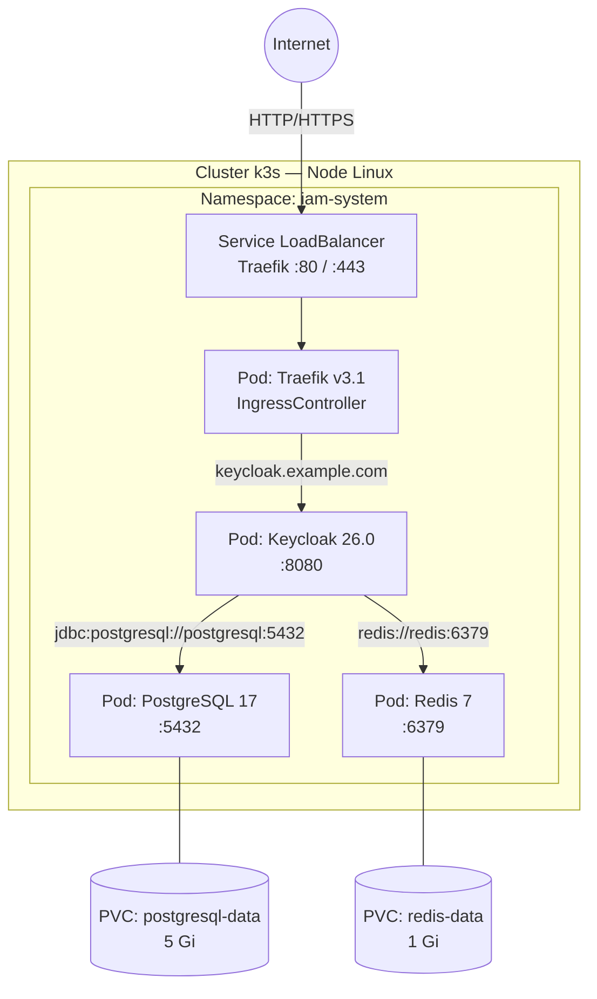

# Module 00 — Introduction à Kubernetes

## C'est quoi Kubernetes ?

Kubernetes (abrégé **K8s**) est un orchestrateur de conteneurs. Son rôle est de :

- **Démarrer** tes conteneurs sur une machine
- **Les redémarrer** automatiquement s'ils plantent
- **Les mettre en réseau** entre eux
- **Gérer leur configuration** et leurs secrets
- **Gérer leur stockage** (volumes)

En résumé : tu lui décris l'état que tu veux (« je veux Keycloak qui tourne »), et K8s fait tout pour maintenir cet état en permanence.

> **Analogie** : K8s est comme un chef de cuisine. Toi tu donnes la commande (« 1 Keycloak, 1 PostgreSQL, 1 Redis »), lui s'assure que les plats arrivent à table et les refait si quelqu'un les reverse.

---

## Sommaire

- [C'est quoi Kubernetes ?](#cest-quoi-kubernetes)
- [Pourquoi k3s et pas Kubernetes standard ?](#pourquoi-k3s-et-pas-kubernetes-standard)
- [Les concepts fondamentaux](#les-concepts-fondamentaux)
- [Architecture globale de ce projet](#architecture-globale-de-ce-projet)
- [Structure des fichiers YAML du projet](#structure-des-fichiers-yaml-du-projet)
- [Ce que tu vas apprendre dans ce cours](#ce-que-tu-vas-apprendre-dans-ce-cours)

---


## Pourquoi k3s et pas Kubernetes standard ?

Kubernetes standard est lourd — il nécessite plusieurs serveurs, beaucoup de RAM, une configuration complexe. **k3s** est une distribution Kubernetes allégée, conçue pour :

- Tourner sur un **seul VPS** (1 CPU, 1-2 Go de RAM)
- Démarrer en **30 secondes**
- Être **identique à Kubernetes standard** du point de vue des manifests YAML

Dans ce projet, k3s est l'orchestrateur cible pour un déploiement sur un VPS Linux (Hetzner, OVH…) ou en cloud managé (AKS/EKS).

---

## Les concepts fondamentaux

Avant d'ouvrir un fichier YAML, voici le vocabulaire de base :

| Terme | Définition simple |
|---|---|
| **Node** | La machine (serveur) sur laquelle K8s tourne |
| **Pod** | La plus petite unité K8s — 1 ou plusieurs conteneurs qui tournent ensemble |
| **Namespace** | Un espace isolé dans le cluster pour grouper des ressources |
| **Deployment** | Un contrôleur qui gère des Pods sans état (stateless) |
| **StatefulSet** | Comme Deployment, mais pour les Pods avec état persistant (bases de données) |
| **Service** | Une adresse réseau stable pour accéder aux Pods |
| **Ingress** | La règle qui dit quel domaine va vers quel Service |
| **ConfigMap** | Stockage de configuration (variables, fichiers) |
| **Secret** | Stockage de données sensibles (mots de passe) |
| **PVC** | Demande de stockage persistant (disque) |

---

## Architecture globale de ce projet

Ce projet déploie une **plateforme IAM** (Identity and Access Management) composée de 4 services dans un namespace K8s dédié.



**Lecture du schéma :**
1. Le navigateur envoie une requête HTTP sur le port 80
2. Le Service LoadBalancer de Traefik reçoit la requête
3. Traefik lit les règles Ingress et route vers Keycloak
4. Keycloak lit sa configuration dans PostgreSQL
5. Keycloak stocke les sessions dans Redis

---

## Structure des fichiers YAML du projet

Tous les manifests Kubernetes vivent dans le dossier `k8s/` :

```
k8s/
├── base/                    ← Manifests communs à TOUS les environnements
│   ├── namespace.yaml
│   ├── traefik/
│   ├── postgresql/
│   ├── redis/
│   ├── keycloak/
│   └── kustomization.yaml
│
└── overlays/                ← Personnalisations par environnement
    ├── linux-server/        ← VPS bare metal (Hetzner, OVH…)
    ├── local-dev/           ← Machine locale WSL2 (test)
    └── cloud/
        ├── azure/           ← AKS (Azure)
        └── aws/             ← EKS (AWS)
```

Le principe : la `base/` contient les règles génériques, les `overlays/` ne contiennent que ce qui change d'un environnement à l'autre (hostname, taille du disque…).

Ce mécanisme s'appelle **Kustomize** — il est expliqué en détail dans le module 08.

---

## Ce que tu vas apprendre dans ce cours

| Module | Sujet |
|---|---|
| 01 | Namespace — isoler les ressources |
| 02 | Pods, Deployments et StatefulSets — faire tourner les conteneurs |
| 03 | Services — le réseau interne K8s |
| 04 | Ingress et Traefik — exposer vers l'extérieur |
| 05 | ConfigMaps et Secrets — gérer la configuration |
| 06 | PersistentVolumeClaims — le stockage |
| 07 | RBAC et ServiceAccount — les permissions |
| 08 | Kustomize — base et overlays |
| 09 | Architecture complète — tout assembler |

---

> **Prochaine étape →** [Module 01 — Namespace](./01-namespace.md)
