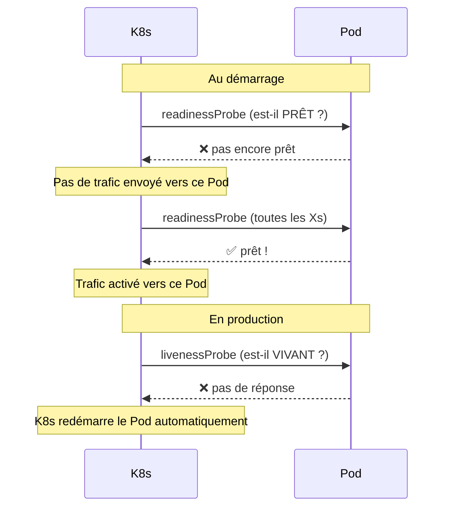
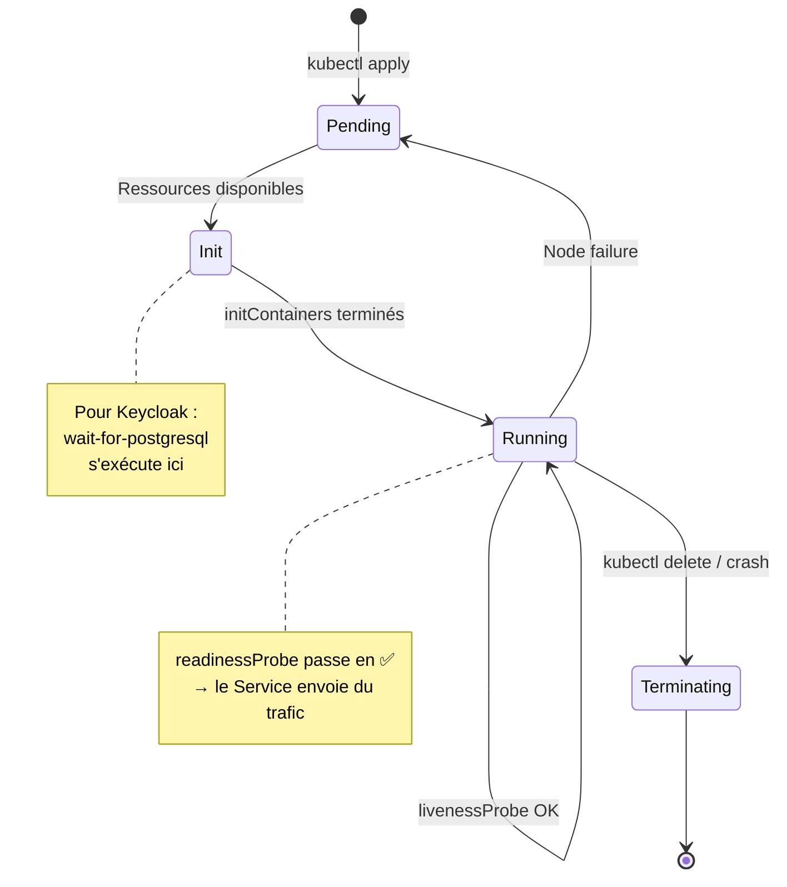
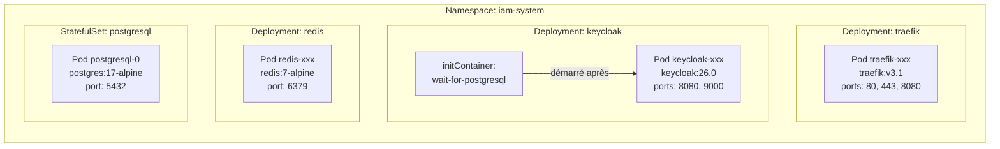

# Module 02 — Pods, Deployments et StatefulSets

## Le Pod — l'unité de base

Un **Pod** est la plus petite chose que K8s peut déployer. C'est un ou plusieurs conteneurs qui :
- **Partagent le même réseau** (même adresse IP interne)
- **Partagent les mêmes volumes** (stockage)
- **Démarrent et s'arrêtent ensemble**

> **Analogie** : un Pod c'est comme un appartement. Les conteneurs dans le Pod sont les colocataires. Ils ont la même adresse (IP), peuvent se parler via `localhost`, et partagent les mêmes pièces (volumes).

En pratique, dans ce projet chaque Pod contient **un seul conteneur** : un Pod Traefik, un Pod Keycloak, etc.

---

## Sommaire

- [Le Pod — l'unité de base](#le-pod-lunité-de-base)
- [Deployment vs StatefulSet — quelle différence ?](#deployment-vs-statefulset-quelle-différence)
- [Les Deployments du projet](#les-deployments-du-projet)
  - [Traefik — `k8s/base/traefik/deployment.yaml`](#traefik-k8sbasetraefikdeploymentyaml)
  - [Keycloak — `k8s/base/keycloak/deployment.yaml`](#keycloak-k8sbasekeycloakdeploymentyaml)
  - [Redis — `k8s/base/redis/deployment.yaml`](#redis-k8sbaseredisdeploymentyaml)
- [Le StatefulSet — PostgreSQL](#le-statefulset-postgresql)
- [Les probes — comment K8s sait si ton Pod est sain ?](#les-probes-comment-k8s-sait-si-ton-pod-est-sain)
- [Schéma — Cycle de vie d'un Pod](#schéma-cycle-de-vie-dun-pod)
- [Schéma — Les 4 Pods du projet](#schéma-les-4-pods-du-projet)
- [Commandes utiles](#commandes-utiles)

---


## Deployment vs StatefulSet — quelle différence ?

Dans ce projet tu as deux types de contrôleurs qui gèrent des Pods :

| | **Deployment** | **StatefulSet** |
|---|---|---|
| **Usage** | Apps sans état (stateless) | Apps avec état (stateful) |
| **Pods** | Interchangeables, anonymes | Identifiés (`postgresql-0`, `postgresql-1`…) |
| **Stockage** | Pas de persistance par défaut | PVC attaché définitivement à chaque Pod |
| **Ordre de démarrage** | Peu importe | Séquentiel et garanti |
| **Dans ce projet** | Traefik, Keycloak, Redis | PostgreSQL |

**Pourquoi PostgreSQL est un StatefulSet ?**
Parce que si le Pod redémarre, K8s doit **obligatoirement** lui rattacher le même disque (avec les données). Avec un Deployment, le disque pourrait être perdu ou rattaché au mauvais Pod.

---

## Les Deployments du projet

### Traefik — `k8s/base/traefik/deployment.yaml`

```yaml
apiVersion: apps/v1
kind: Deployment
metadata:
  name: traefik
  namespace: iam-system
  labels:
    app.kubernetes.io/name: traefik
    app.kubernetes.io/component: ingress-controller
spec:
  replicas: 1                     # ← 1 seul Pod Traefik
  selector:
    matchLabels:
      app.kubernetes.io/name: traefik   # ← Ce Deployment gère les Pods avec ce label
  template:                       # ← Modèle pour créer les Pods
    metadata:
      labels:
        app.kubernetes.io/name: traefik          # ← Label mis sur chaque Pod créé
        app.kubernetes.io/component: ingress-controller
    spec:
      serviceAccountName: traefik  # ← Identité K8s pour les permissions (voir module 07)
      containers:
        - name: traefik
          image: traefik:v3.1      # ← L'image Docker à utiliser
          args:
            - --providers.kubernetesingress=true  # Traefik lit les Ingress K8s
            - --providers.file.filename=/etc/traefik/middlewares.yaml
            - --entrypoints.web.address=:80       # Port HTTP
            - --entrypoints.websecure.address=:443 # Port HTTPS
            - --entrypoints.traefik.address=:8080  # Port dashboard/healthcheck
            - --ping=true                          # Active l'endpoint /ping (healthcheck)
          ports:
            - name: web
              containerPort: 80
            - name: websecure
              containerPort: 443
            - name: traefik
              containerPort: 8080
          resources:
            requests:
              cpu: 100m        # ← 0.1 CPU garanti
              memory: 64Mi     # ← 64 Mo RAM garantis
            limits:
              memory: 256Mi    # ← Jamais plus de 256 Mo (sinon K8s tue le Pod)
          volumeMounts:
            - name: middlewares-config
              mountPath: /etc/traefik/middlewares.yaml  # Fichier injecté depuis ConfigMap
              subPath: middlewares.yaml
          readinessProbe:      # ← K8s vérifie que le Pod est PRÊT à recevoir du trafic
            httpGet:
              path: /ping
              port: traefik
            initialDelaySeconds: 5   # Attendre 5s avant le 1er check
            periodSeconds: 10        # Vérifier toutes les 10s
          livenessProbe:       # ← K8s vérifie que le Pod est VIVANT (redémarre sinon)
            httpGet:
              path: /ping
              port: traefik
            initialDelaySeconds: 10
            periodSeconds: 30
      volumes:
        - name: middlewares-config
          configMap:
            name: traefik-middlewares  # Monter le ConfigMap comme fichier (voir module 05)
```

### Keycloak — `k8s/base/keycloak/deployment.yaml`

```yaml
apiVersion: apps/v1
kind: Deployment
metadata:
  name: keycloak
  namespace: iam-system
spec:
  replicas: 1
  selector:
    matchLabels:
      app.kubernetes.io/name: keycloak
  template:
    spec:
      initContainers:                    # ← Conteneur qui tourne AVANT le conteneur principal
        - name: wait-for-postgresql
          image: busybox:1.36
          command:
            - sh
            - -c
            - until nc -z postgresql 5432; do echo "waiting..."; sleep 2; done
          # Boucle jusqu'à ce que PostgreSQL réponde sur le port 5432
          # Keycloak ne démarre que quand cette condition est vraie

      containers:
        - name: keycloak
          image: quay.io/keycloak/keycloak:26.0
          args: ["start"]               # Mode production
          env:
            - name: KC_DB
              value: postgres
            - name: KC_DB_URL
              value: jdbc:postgresql://postgresql:5432/kc_db
              # "postgresql" = nom DNS du Service PostgreSQL (voir module 03)
            - name: KC_DB_USERNAME
              valueFrom:
                configMapKeyRef:         # ← Lu depuis un ConfigMap
                  name: postgresql-config
                  key: USER_BD
            - name: KC_DB_PASSWORD
              valueFrom:
                secretKeyRef:            # ← Lu depuis un Secret (jamais en clair !)
                  name: pg-password
                  key: password
            - name: KC_HOSTNAME
              valueFrom:
                configMapKeyRef:
                  name: keycloak-config
                  key: KEYCLOAK_HOSTNAME  # Valeur patchée par l'overlay
          ports:
            - name: http
              containerPort: 8080        # Trafic applicatif
            - name: management
              containerPort: 9000        # Endpoints de santé Keycloak
          livenessProbe:
            httpGet:
              path: /health/live
              port: management           # Keycloak expose sa santé sur le port 9000
            initialDelaySeconds: 90      # Keycloak prend du temps à démarrer !
            periodSeconds: 10
            failureThreshold: 6
          readinessProbe:
            httpGet:
              path: /health/ready
              port: management
            initialDelaySeconds: 60
          resources:
            requests:
              cpu: 200m
              memory: 512Mi
            limits:
              memory: 1Gi               # Keycloak est gourmand en mémoire
```

### Redis — `k8s/base/redis/deployment.yaml`

```yaml
apiVersion: apps/v1
kind: Deployment
metadata:
  name: redis
  namespace: iam-system
spec:
  replicas: 1
  template:
    spec:
      containers:
        - name: redis
          image: redis:7-alpine
          command:
            - redis-server
            - --requirepass
            - $(REDIS_PASSWORD)         # Le mot de passe lu depuis le Secret
            - --maxmemory
            - 512mb                     # Limite mémoire applicative Redis
            - --maxmemory-policy
            - allkeys-lru               # Éviction LRU quand plein
            - --appendonly
            - "yes"                     # Persistence sur disque activée
          env:
            - name: REDIS_PASSWORD
              valueFrom:
                secretKeyRef:
                  name: redis-password
                  key: password
          volumeMounts:
            - name: redis-data
              mountPath: /data          # Données Redis persistées dans le PVC
          livenessProbe:
            exec:
              command: ["redis-cli", "-a", "$(REDIS_PASSWORD)", "ping"]
            initialDelaySeconds: 15
```

---

## Le StatefulSet — PostgreSQL

**`k8s/base/postgresql/statefulset.yaml`**

```yaml
apiVersion: apps/v1
kind: StatefulSet                  # ← Pas un Deployment !
metadata:
  name: postgresql
  namespace: iam-system
spec:
  serviceName: postgresql          # ← Lié au Service headless du même nom
  replicas: 1
  selector:
    matchLabels:
      app.kubernetes.io/name: postgresql
  template:
    spec:
      containers:
        - name: postgresql
          image: postgres:17-alpine
          env:
            - name: POSTGRES_DB
              valueFrom:
                configMapKeyRef:
                  name: postgresql-config
                  key: DB_NAME          # kc_db
            - name: POSTGRES_USER
              valueFrom:
                configMapKeyRef:
                  name: postgresql-config
                  key: USER_BD          # admin
            - name: POSTGRES_PASSWORD
              valueFrom:
                secretKeyRef:
                  name: pg-password
                  key: password
            - name: PGDATA
              value: /var/lib/postgresql/data/pgdata  # Chemin des données
          volumeMounts:
            - name: postgresql-data
              mountPath: /var/lib/postgresql/data     # Monté depuis le PVC
            - name: init-scripts
              mountPath: /docker-entrypoint-initdb.d  # Scripts SQL d'init (ConfigMap)
          livenessProbe:
            exec:
              command: ["pg_isready", "-U", "$(POSTGRES_USER)", "-d", "$(POSTGRES_DB)"]
            initialDelaySeconds: 30
          resources:
            requests:
              cpu: 100m
              memory: 256Mi
            limits:
              memory: 512Mi
      volumes:
        - name: init-scripts
          configMap:
            name: postgresql-init      # Scripts SQL au premier démarrage
        - name: postgresql-data
          persistentVolumeClaim:
            claimName: postgresql-data # Le PVC 5Gi (voir module 06)
```

---

## Les probes — comment K8s sait si ton Pod est sain ?

K8s surveille chaque Pod grâce à deux mécanismes :



| Probe | Rôle | Action si échec |
|---|---|---|
| `readinessProbe` | « Le Pod peut-il recevoir du trafic ? » | Retiré du Service (plus de requêtes) |
| `livenessProbe` | « Le Pod est-il encore en vie ? » | Redémarrage automatique du Pod |

---

## Schéma — Cycle de vie d'un Pod



---

## Schéma — Les 4 Pods du projet



---

## Commandes utiles

```bash
# Voir l'état de tous les Pods
kubectl get pods -n iam-system

# Voir les détails d'un Pod (utile pour déboguer)
kubectl describe pod -n iam-system <nom-du-pod>

# Voir les logs d'un Pod
kubectl logs -n iam-system deployment/keycloak -f

# Entrer dans un Pod (comme un docker exec)
kubectl exec -it -n iam-system deployment/keycloak -- sh

# Redémarrer un Deployment (sans temps d'arrêt)
kubectl rollout restart deployment/keycloak -n iam-system
```

---

> **Prochaine étape →** [Module 03 — Services et réseau](./03-services-reseau.md)
