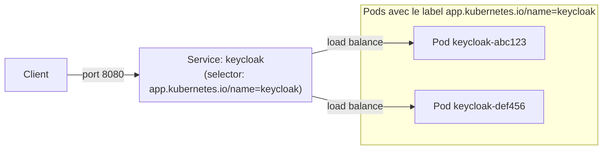
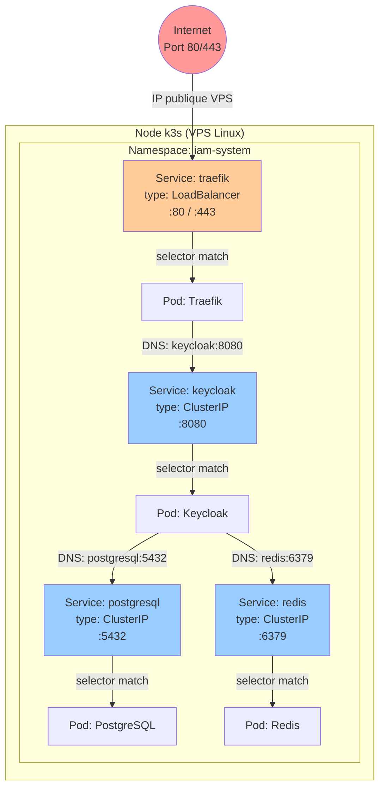

# Module 03 — Services et réseau interne

## Le problème sans Service

Un Pod a une adresse IP interne dans le cluster. Mais cette IP **change à chaque redémarrage**. Si Keycloak essaie de se connecter à PostgreSQL via son IP, dès que PostgreSQL redémarre (pour une mise à jour, un crash…), la connexion est perdue.

**Solution :** le **Service** est une adresse stable, un nom DNS fixe, qui pointe toujours vers les Pods correspondants — même si ces Pods redémarrent et changent d'IP.

> **Analogie** : le Service c'est comme l'accueil d'une entreprise. Peu importe qui est au bureau ce jour-là, tu appelles toujours le même numéro et on te redirige vers la bonne personne.

---

## Sommaire

- [Le problème sans Service](#le-problème-sans-service)
- [Comment un Service trouve ses Pods ?](#comment-un-service-trouve-ses-pods)
- [Les deux types de Services dans ce projet](#les-deux-types-de-services-dans-ce-projet)
  - [ClusterIP — communication interne uniquement](#clusterip-communication-interne-uniquement)
  - [LoadBalancer — exposition vers l'extérieur](#loadbalancer-exposition-vers-lextérieur)
- [Le DNS interne Kubernetes](#le-dns-interne-kubernetes)
- [Schéma — Architecture réseau complète](#schéma-architecture-réseau-complète)
- [Résumé des Services du projet](#résumé-des-services-du-projet)
- [Commandes utiles](#commandes-utiles)

---


## Comment un Service trouve ses Pods ?

Un Service utilise un **selector** basé sur les labels. Il envoie le trafic vers **tous les Pods** qui portent les labels correspondants.



Si tu augmentais `replicas: 2`, il y aurait 2 Pods Keycloak et le Service répartirait automatiquement le trafic entre eux (load balancing).

---

## Les deux types de Services dans ce projet

### ClusterIP — communication interne uniquement

**Utilisé par :** Keycloak, PostgreSQL, Redis

Un Service `ClusterIP` n'est accessible **qu'à l'intérieur du cluster**. C'est exactement ce qu'on veut pour une base de données ou un cache : on ne veut pas qu'ils soient accessibles depuis Internet.

```yaml
# k8s/base/keycloak/service.yaml
apiVersion: v1
kind: Service
metadata:
  name: keycloak          # ← Ce nom devient un nom DNS dans le cluster
  namespace: iam-system
spec:
  type: ClusterIP         # ← Accessible uniquement en interne
  selector:
    app.kubernetes.io/name: keycloak  # ← Redirige vers les Pods avec ce label
  ports:
    - name: http
      port: 8080          # ← Port exposé par le Service
      targetPort: http    # ← Port du conteneur (référence au "name: http" dans le Pod)
      protocol: TCP
```

```yaml
# k8s/base/postgresql/service.yaml
apiVersion: v1
kind: Service
metadata:
  name: postgresql        # → DNS "postgresql" accessible dans le namespace
  namespace: iam-system
spec:
  type: ClusterIP
  selector:
    app.kubernetes.io/name: postgresql
  ports:
    - name: postgresql
      port: 5432
      targetPort: postgresql
```

```yaml
# k8s/base/redis/service.yaml
apiVersion: v1
kind: Service
metadata:
  name: redis             # → DNS "redis" accessible dans le namespace
  namespace: iam-system
spec:
  type: ClusterIP
  selector:
    app.kubernetes.io/name: redis
  ports:
    - name: redis
      port: 6379
      targetPort: redis
```

### LoadBalancer — exposition vers l'extérieur

**Utilisé par :** Traefik uniquement

Un Service `LoadBalancer` demande au cluster d'attribuer une IP publique (ou un port sur le Node) accessible depuis l'extérieur.

```yaml
# k8s/base/traefik/service.yaml
apiVersion: v1
kind: Service
metadata:
  name: traefik
  namespace: iam-system
spec:
  type: LoadBalancer      # ← IP publique attribuée par k3s / AKS / EKS
  selector:
    app.kubernetes.io/name: traefik
  ports:
    - name: web
      port: 80
      targetPort: web
    - name: websecure
      port: 443
      targetPort: websecure
```

Avec k3s sur VPS, l'IP publique du serveur est utilisée. Sur AKS/EKS, un vrai Load Balancer cloud est créé.

---

## Le DNS interne Kubernetes

C'est l'une des choses les plus puissantes de K8s : **chaque Service obtient automatiquement un nom DNS**.

Dans le même namespace, tu peux joindre un Service juste par son nom :
- `postgresql` → Service PostgreSQL (port 5432)
- `redis` → Service Redis (port 6379)
- `keycloak` → Service Keycloak (port 8080)

C'est exactement pourquoi dans le Deployment Keycloak on voit :

```yaml
- name: KC_DB_URL
  value: jdbc:postgresql://postgresql:5432/kc_db
                          ^^^^^^^^^^
                          Nom du Service PostgreSQL
                          K8s résout ce nom en IP interne automatiquement
```

Et dans le Deployment Keycloak, l'initContainer :
```yaml
command: ["sh", "-c", "until nc -z postgresql 5432; do sleep 2; done"]
                                   ^^^^^^^^^^
                                   Même nom DNS — K8s le résout
```

Le nom DNS complet est : `<service>.<namespace>.svc.cluster.local`
Mais dans le même namespace, le nom court suffit.

---

## Schéma — Architecture réseau complète



**Ce que ce schéma montre :**
- Internet → LoadBalancer (seul point d'entrée public)
- Tout le reste passe par des ClusterIP (réseau interne privé)
- Les Pods se parlent via leurs Services (DNS stable), pas directement

---

## Résumé des Services du projet

| Service | Type | Port | Accessible depuis |
|---|---|---|---|
| `traefik` | LoadBalancer | 80, 443 | Internet |
| `keycloak` | ClusterIP | 8080 | Cluster uniquement |
| `postgresql` | ClusterIP | 5432 | Cluster uniquement |
| `redis` | ClusterIP | 6379 | Cluster uniquement |

---

## Commandes utiles

```bash
# Voir tous les Services
kubectl get services -n iam-system

# Détails d'un Service (voir les endpoints / Pods cibles)
kubectl describe service keycloak -n iam-system

# Tester la résolution DNS depuis un Pod (debug)
kubectl exec -it -n iam-system deployment/keycloak -- sh
# Puis dans le Pod :
# nslookup postgresql
# nc -z postgresql 5432 && echo "OK"
```

---

> **Prochaine étape →** [Module 04 — Ingress et Traefik](./04-ingress-traefik.md)
