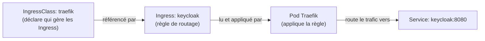
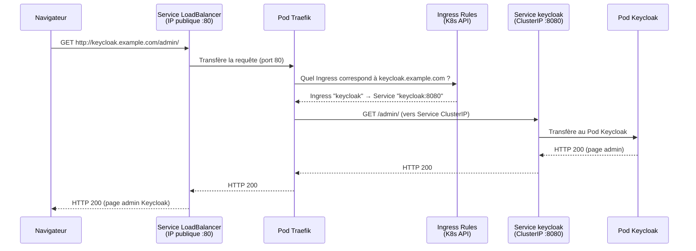
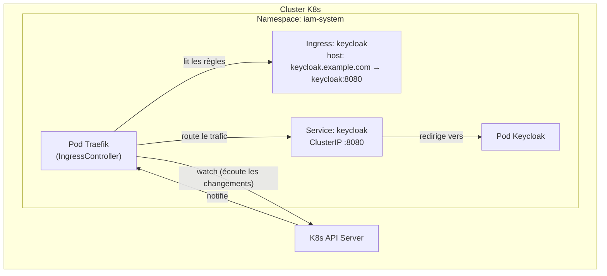

# Module 04 — Ingress et Traefik

## Le problème sans Ingress

On a vu qu'un Service `LoadBalancer` expose un port vers Internet. Mais si on a 5 applications, faut-il 5 LoadBalancers avec 5 IP publiques ? C'est coûteux et ingérable.

**Solution :** l'**Ingress**. C'est une règle qui dit : « si la requête arrive sur le domaine `keycloak.example.com`, envoie-la au Service `keycloak` ». Toutes les requêtes entrent par un seul point (le LoadBalancer de Traefik) et sont ensuite routées selon le domaine.

> **Analogie** : Traefik est un réceptionniste dans un immeuble de bureaux. Une seule porte d'entrée, et selon ce que tu demandes (« j'ai rendez-vous chez Keycloak »), il t'envoie au bon bureau.

---

## Sommaire

- [Le problème sans Ingress](#le-problème-sans-ingress)
- [Les 3 pièces du puzzle](#les-3-pièces-du-puzzle)
- [1. IngressClass — `k8s/base/traefik/ingressclass.yaml`](#1-ingressclass-k8sbasetraefikingressclassyaml)
- [2. Ingress — `k8s/base/keycloak/ingress.yaml`](#2-ingress-k8sbasekeycloakingressyaml)
- [3. Traefik — l'IngressController](#3-traefik-lingresscontroller)
- [Les Middlewares — `k8s/base/traefik/configmap-middlewares.yaml`](#les-middlewares-k8sbasetraefikconfigmap-middlewaresyaml)
- [Schéma — Flux complet d'une requête HTTP](#schéma-flux-complet-dune-requête-http)
- [Schéma — Comment Traefik surveille les Ingress](#schéma-comment-traefik-surveille-les-ingress)
- [Différence selon l'environnement](#différence-selon-lenvironnement)
- [Commandes utiles](#commandes-utiles)

---


## Les 3 pièces du puzzle

Pour exposer Keycloak vers Internet, il faut 3 objets K8s :



---

## 1. IngressClass — `k8s/base/traefik/ingressclass.yaml`

L'**IngressClass** déclare qui est responsable de gérer les objets Ingress dans le cluster.

```yaml
apiVersion: networking.k8s.io/v1
kind: IngressClass
metadata:
  name: traefik           # ← Nom de cette classe d'Ingress
  annotations:
    ingressclass.kubernetes.io/is-default-class: "true"  # ← Classe par défaut du cluster
  labels:
    app.kubernetes.io/name: traefik
    app.kubernetes.io/component: ingress-controller
spec:
  controller: traefik.io/ingress-controller  # ← Indique que Traefik est le contrôleur
```

Pourquoi ça existe ? Parce qu'un cluster peut avoir plusieurs IngressControllers (Nginx, Traefik, HAProxy…). L'IngressClass dit à K8s lequel utiliser.

---

## 2. Ingress — `k8s/base/keycloak/ingress.yaml`

L'**Ingress** est la règle de routage elle-même.

```yaml
apiVersion: networking.k8s.io/v1
kind: Ingress
metadata:
  name: keycloak
  namespace: iam-system
  annotations:
    traefik.ingress.kubernetes.io/router.entrypoints: web  # ← Utiliser l'entrypoint HTTP (:80)
  labels:
    app.kubernetes.io/name: keycloak
    app.kubernetes.io/component: iam
spec:
  ingressClassName: traefik           # ← Utiliser la classe "traefik" déclarée ci-dessus
  rules:
    - host: keycloak.example.com      # ← Ce domaine (patché par overlay selon l'env)
      http:
        paths:
          - path: /                   # ← Toutes les URLs (/)
            pathType: Prefix
            backend:
              service:
                name: keycloak        # ← Envoyer au Service "keycloak"
                port:
                  name: http          # ← Sur le port nommé "http" (8080)
```

**Point crucial :** le `host: keycloak.example.com` est une valeur par défaut dans la `base/`. Elle est **remplacée par l'overlay** de chaque environnement :
- `linux-server` → `keycloak.monvps.com` (ton vrai domaine)
- `local-dev` → `keycloak.local` (pour tester en local)
- `cloud/aws` → `keycloak.mondomaine.aws.com`

---

## 3. Traefik — l'IngressController

Traefik est le composant qui lit tous les objets Ingress du cluster et applique les règles de routage. Il est lui-même déployé comme un Pod K8s (voir module 02).

```yaml
# Extrait du deployment.yaml de Traefik
args:
  - --providers.kubernetesingress=true  # ← Traefik surveille les Ingress K8s
  - --providers.file.filename=/etc/traefik/middlewares.yaml  # ← Config additionnelle
  - --entrypoints.web.address=:80       # ← Écoute sur le port 80 (HTTP)
  - --entrypoints.websecure.address=:443 # ← Écoute sur le port 443 (HTTPS)
  - --entrypoints.traefik.address=:8080  # ← Port interne (dashboard, healthcheck)
  - --ping=true                          # ← Endpoint /ping pour les probes K8s
```

Traefik surveille en continu l'API K8s. Dès qu'un Ingress est créé/modifié/supprimé, Traefik met à jour ses règles de routage automatiquement.

---

## Les Middlewares — `k8s/base/traefik/configmap-middlewares.yaml`

Un **middleware** Traefik est une transformation appliquée à la requête avant ou après l'envoi au backend.

```yaml
apiVersion: v1
kind: ConfigMap
metadata:
  name: traefik-middlewares
  namespace: iam-system
data:
  middlewares.yaml: |           # ← Fichier de config Traefik au format YAML
    http:
      middlewares:
        strip-hsts:             # ← Nom du middleware
          headers:
            customResponseHeaders:
              Strict-Transport-Security: ""  # ← Supprime le header HSTS de la réponse
```

**Pourquoi ce middleware ?** Le header `Strict-Transport-Security` (HSTS) force le navigateur à toujours utiliser HTTPS pour ce domaine. En local (`keycloak.local`), c'est problématique car on teste en HTTP. Ce middleware supprime ce header pour éviter que le navigateur bloque l'accès HTTP.

Ce ConfigMap est monté comme fichier dans le Pod Traefik (via `volumeMounts`), et Traefik le lit via l'argument `--providers.file.filename=...`.

---

## Schéma — Flux complet d'une requête HTTP



---

## Schéma — Comment Traefik surveille les Ingress



Traefik a les **droits de lire l'API K8s** grâce au RBAC configuré dans `clusterrole.yaml` (voir module 07).

---

## Différence selon l'environnement

| Environnement | Hostname Ingress | Mode Keycloak |
|---|---|---|
| `linux-server` | `keycloak.tondomaine.com` | `start` (production) |
| `local-dev` | `keycloak.local` | `start-dev` (dev, pas de TLS) |
| `cloud/azure` | `keycloak.tondomaine.azure.com` | `start` (production) |
| `cloud/aws` | `keycloak.tondomaine.aws.com` | `start` (production) |

L'overlay `local-dev` ajoute aussi :
```yaml
# k8s/overlays/local-dev/patches/keycloak-args.yaml
env:
  - name: KC_HOSTNAME_STRICT_HTTPS
    value: "false"   # ← Désactive le forçage HTTPS (inutile en local)
```

---

## Commandes utiles

```bash
# Voir tous les Ingress
kubectl get ingress -n iam-system

# Détails de l'Ingress Keycloak (voir les règles)
kubectl describe ingress keycloak -n iam-system

# Voir les logs Traefik (routage, erreurs)
kubectl logs -n iam-system deployment/traefik -f

# Valider qu'une URL est bien routée
curl -H "Host: keycloak.example.com" http://<IP-VPS>/
```

---

> **Prochaine étape →** [Module 05 — ConfigMaps et Secrets](./05-configmaps-secrets.md)
