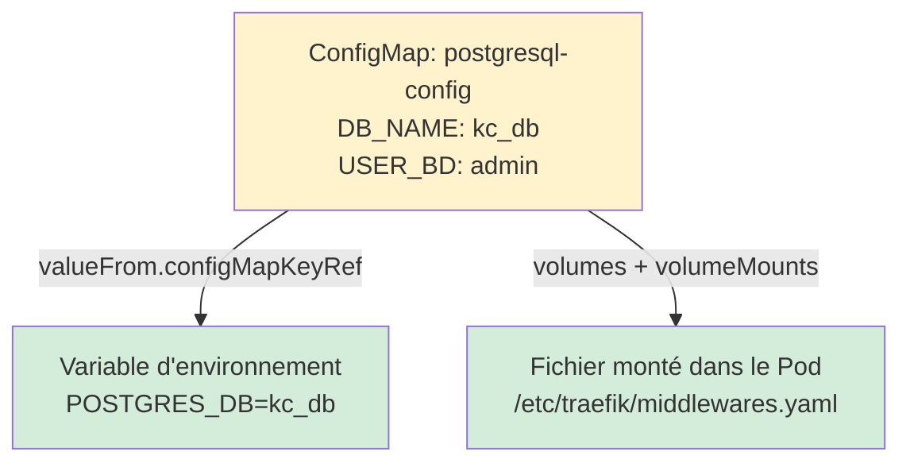
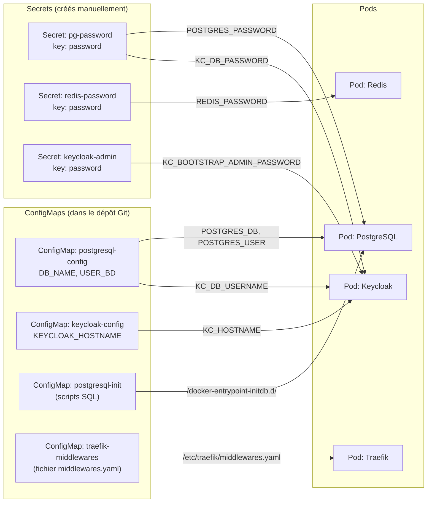

# Module 05 — ConfigMaps et Secrets

## Le problème : comment configurer les conteneurs ?

Les conteneurs Docker ne doivent pas contenir de configuration en dur (hostnames, mots de passe…). En Kubernetes, la configuration est **injectée de l'extérieur** via deux objets :

| Objet | Usage | Exemple |
|---|---|---|
| **ConfigMap** | Configuration non-sensible | Nom de la base de données, hostname, options |
| **Secret** | Données sensibles | Mots de passe, tokens, clés API |

> **Règle d'or :** jamais de mot de passe dans un fichier YAML commité dans Git. Les Secrets K8s sont créés manuellement sur le cluster et ne sont **jamais** dans le code source.

---

## Sommaire

- [Le problème : comment configurer les conteneurs ?](#le-problème-comment-configurer-les-conteneurs)
- [ConfigMaps dans ce projet](#configmaps-dans-ce-projet)
  - [ConfigMap PostgreSQL — `k8s/base/postgresql/configmap.yaml`](#configmap-postgresql-k8sbasepostgresqlconfigmapyaml)
  - [ConfigMap Keycloak — `k8s/base/keycloak/configmap.yaml`](#configmap-keycloak-k8sbasekeycloakconfigmapyaml)
  - [ConfigMap PostgreSQL Init — `k8s/base/postgresql/configmap-init.yaml`](#configmap-postgresql-init-k8sbasepostgresqlconfigmap-inityaml)
  - [ConfigMap Middlewares Traefik — `k8s/base/traefik/configmap-middlewares.yaml`](#configmap-middlewares-traefik-k8sbasetraefikconfigmap-middlewaresyaml)
- [Les deux façons d'utiliser un ConfigMap](#les-deux-façons-dutiliser-un-configmap)
- [Secrets dans ce projet](#secrets-dans-ce-projet)
  - [Les 3 Secrets requis par ce projet](#les-3-secrets-requis-par-ce-projet)
  - [Comment ils sont consommés](#comment-ils-sont-consommés)
- [Schéma — Qui consomme quoi](#schéma-qui-consomme-quoi)
- [Bonne pratique : vérifier les Secrets avant de déployer](#bonne-pratique-vérifier-les-secrets-avant-de-déployer)
- [Commandes utiles](#commandes-utiles)

---


## ConfigMaps dans ce projet

### ConfigMap PostgreSQL — `k8s/base/postgresql/configmap.yaml`

```yaml
apiVersion: v1
kind: ConfigMap
metadata:
  name: postgresql-config      # ← Nom référencé dans les Deployments
  namespace: iam-system
data:
  DB_NAME: kc_db               # ← Nom de la base de données Keycloak
  USER_BD: admin               # ← Utilisateur PostgreSQL
```

Ces valeurs sont consommées dans le StatefulSet PostgreSQL ET dans le Deployment Keycloak :

```yaml
# Dans le StatefulSet PostgreSQL
env:
  - name: POSTGRES_DB
    valueFrom:
      configMapKeyRef:
        name: postgresql-config  # ← Le ConfigMap ci-dessus
        key: DB_NAME             # ← La clé "DB_NAME" → valeur "kc_db"

# Dans le Deployment Keycloak
env:
  - name: KC_DB_USERNAME
    valueFrom:
      configMapKeyRef:
        name: postgresql-config
        key: USER_BD             # ← La clé "USER_BD" → valeur "admin"
```

Un seul ConfigMap, deux conteneurs qui le lisent. Si tu changes `USER_BD`, tu n'as qu'un seul endroit à modifier.

---

### ConfigMap Keycloak — `k8s/base/keycloak/configmap.yaml`

```yaml
apiVersion: v1
kind: ConfigMap
metadata:
  name: keycloak-config
  namespace: iam-system
data:
  KEYCLOAK_HOSTNAME: keycloak.example.com  # ← Valeur par défaut, patchée par l'overlay
```

Cette valeur est patchée différemment selon l'environnement. Par exemple, pour `linux-server` :

```yaml
# k8s/overlays/linux-server/patches/keycloak-hostname.yaml
apiVersion: v1
kind: ConfigMap
metadata:
  name: keycloak-config
  namespace: iam-system
data:
  KEYCLOAK_HOSTNAME: keycloak.example.com  # ← Remplacé par ton vrai domaine
```

---

### ConfigMap PostgreSQL Init — `k8s/base/postgresql/configmap-init.yaml`

```yaml
apiVersion: v1
kind: ConfigMap
metadata:
  name: postgresql-init
  namespace: iam-system
data:
  # Fichiers SQL exécutés au premier démarrage de PostgreSQL
  # Actuellement vide — la DB et l'user sont créés par les variables d'env POSTGRES_*
```

Ce ConfigMap est monté comme **répertoire** dans le conteneur PostgreSQL :

```yaml
# Dans le StatefulSet PostgreSQL
volumeMounts:
  - name: init-scripts
    mountPath: /docker-entrypoint-initdb.d  # ← PostgreSQL exécute les .sql ici au démarrage
volumes:
  - name: init-scripts
    configMap:
      name: postgresql-init
```

Tu peux ajouter des scripts SQL d'initialisation dans ce ConfigMap (création de schémas, données par défaut…). PostgreSQL les exécutera automatiquement au premier démarrage.

---

### ConfigMap Middlewares Traefik — `k8s/base/traefik/configmap-middlewares.yaml`

```yaml
apiVersion: v1
kind: ConfigMap
metadata:
  name: traefik-middlewares
  namespace: iam-system
data:
  middlewares.yaml: |           # ← Une clé dont la valeur est un fichier YAML entier
    http:
      middlewares:
        strip-hsts:
          headers:
            customResponseHeaders:
              Strict-Transport-Security: ""
```

Ici le ConfigMap est monté comme un **fichier** (pas des variables d'environnement) :

```yaml
# Dans le Deployment Traefik
volumeMounts:
  - name: middlewares-config
    mountPath: /etc/traefik/middlewares.yaml  # ← Fichier créé à cet emplacement
    subPath: middlewares.yaml                 # ← Seulement la clé "middlewares.yaml" du ConfigMap
volumes:
  - name: middlewares-config
    configMap:
      name: traefik-middlewares
```

---

## Les deux façons d'utiliser un ConfigMap



---

## Secrets dans ce projet

Les Secrets fonctionnent exactement comme les ConfigMaps, mais :
- Les valeurs sont **encodées en base64** (attention : pas chiffrées, juste encodées !)
- Ils sont **créés manuellement** sur le cluster, jamais dans les fichiers YAML commités
- K8s les transmet aux Pods de façon sécurisée

### Les 3 Secrets requis par ce projet

```bash
# Secret pour PostgreSQL
kubectl create secret generic pg-password \
  --from-literal=password='MonMotDePasseDB!' \
  -n iam-system

# Secret pour Redis
kubectl create secret generic redis-password \
  --from-literal=password='MonMotDePasseRedis!' \
  -n iam-system

# Secret pour le compte admin Keycloak
kubectl create secret generic keycloak-admin \
  --from-literal=password='MonMotDePasseAdmin!' \
  -n iam-system
```

### Comment ils sont consommés

**Dans PostgreSQL** (StatefulSet) :
```yaml
env:
  - name: POSTGRES_PASSWORD
    valueFrom:
      secretKeyRef:
        name: pg-password     # ← Nom du Secret
        key: password         # ← Clé dans le Secret
```

**Dans Keycloak** (Deployment) :
```yaml
env:
  - name: KC_DB_PASSWORD
    valueFrom:
      secretKeyRef:
        name: pg-password     # ← Même Secret que PostgreSQL !
        key: password

  - name: KC_BOOTSTRAP_ADMIN_PASSWORD
    valueFrom:
      secretKeyRef:
        name: keycloak-admin  # ← Secret différent pour le compte admin
        key: password
```

**Dans Redis** (Deployment) :
```yaml
env:
  - name: REDIS_PASSWORD
    valueFrom:
      secretKeyRef:
        name: redis-password
        key: password
```

---

## Schéma — Qui consomme quoi



---

## Bonne pratique : vérifier les Secrets avant de déployer

Le projet fournit un script dédié :

```bash
./secrets/check-secrets.sh --env linux-server
# Vérifie que pg-password, redis-password et keycloak-admin existent dans iam-system
# Résultat attendu : OK: tous les secrets requis sont présents.
```

Si un Secret manque, Keycloak ou PostgreSQL ne démarreront pas (le Pod restera en `Pending` avec une erreur `secret not found`).

---

## Commandes utiles

```bash
# Lister les Secrets du namespace (les valeurs ne sont pas affichées)
kubectl get secrets -n iam-system

# Voir la structure d'un Secret (valeurs en base64)
kubectl get secret pg-password -n iam-system -o yaml

# Décoder une valeur base64 (pour vérifier)
kubectl get secret pg-password -n iam-system -o jsonpath='{.data.password}' | base64 -d

# Lister les ConfigMaps
kubectl get configmaps -n iam-system

# Voir le contenu d'un ConfigMap
kubectl get configmap postgresql-config -n iam-system -o yaml
```

---

> **Prochaine étape →** [Module 06 — Stockage et PersistentVolumeClaims](./06-stockage-pvc.md)
