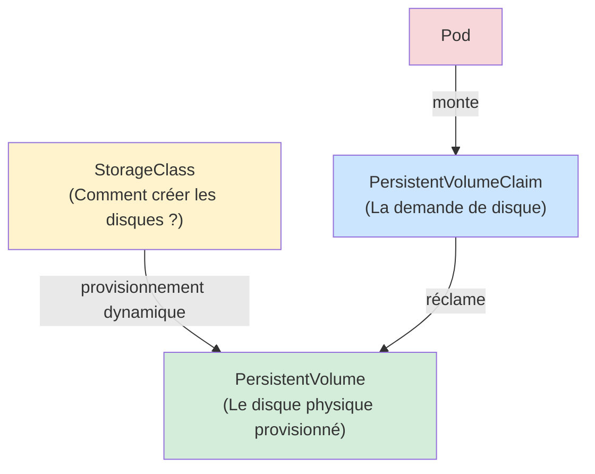
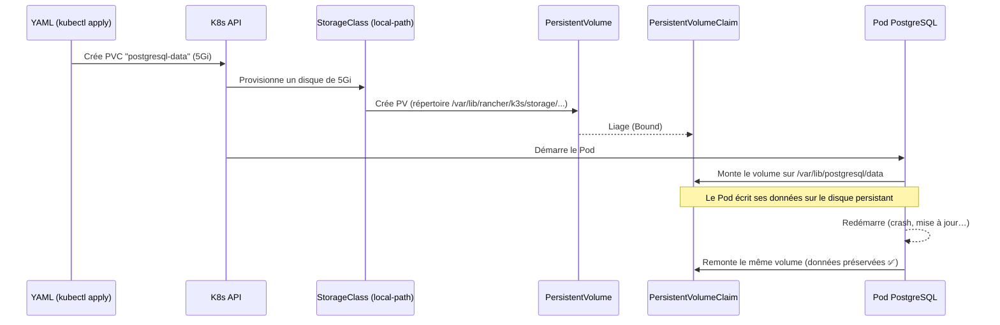
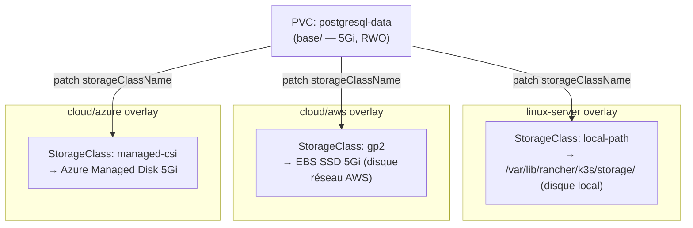

# Module 06 — Stockage et PersistentVolumeClaims

## Le problème du stockage dans K8s

Par défaut, quand un Pod redémarre, **tout ce qu'il avait écrit sur son disque est perdu**. C'est parfait pour des apps stateless (Traefik, Keycloak), mais catastrophique pour une base de données.

> **Analogie** : imagine que tu perds tous tes fichiers à chaque fois que tu étiens ton PC. Pour les apps sans état, c'est acceptable. Pour PostgreSQL, c'est une catastrophe.

**Solution :** les **PersistentVolumes** — des disques qui survivent aux redémarrages de Pods.

---

## Sommaire

- [Le problème du stockage dans K8s](#le-problème-du-stockage-dans-k8s)
- [Les 3 objets du stockage K8s](#les-3-objets-du-stockage-k8s)
- [Les PVC du projet](#les-pvc-du-projet)
  - [PVC PostgreSQL — `k8s/base/postgresql/pvc.yaml`](#pvc-postgresql-k8sbasepostgresqlpvcyaml)
  - [PVC Redis — `k8s/base/redis/pvc.yaml`](#pvc-redis-k8sbaseredispvcyaml)
- [StorageClass — ce qui change selon l'environnement](#storageclass-ce-qui-change-selon-lenvironnement)
  - [linux-server — `k8s/overlays/linux-server/patches/postgresql-storage.yaml`](#linux-server-k8soverlayslinux-serverpatchespostgresql-storageyaml)
  - [cloud/aws — `k8s/overlays/cloud/aws/patches/postgresql-storage.yaml`](#cloudaws-k8soverlayscloudawspatchespostgresql-storageyaml)
  - [cloud/azure — `k8s/overlays/cloud/azure/patches/postgresql-storage.yaml`](#cloudazure-k8soverlayscloudazurepatchespostgresql-storageyaml)
- [Les modes d'accès](#les-modes-daccès)
- [Comment le PVC est monté dans un Pod](#comment-le-pvc-est-monté-dans-un-pod)
- [Schéma — Le cycle de vie du stockage](#schéma-le-cycle-de-vie-du-stockage)
- [Schéma — Différence de stockage par environnement](#schéma-différence-de-stockage-par-environnement)
- [Commandes utiles](#commandes-utiles)

---


## Les 3 objets du stockage K8s



| Objet | Qui le gère | Rôle |
|---|---|---|
| **StorageClass** | Administrateur cluster | Définit comment créer les disques (local, SSD, NFS…) |
| **PersistentVolume (PV)** | K8s (automatique) | Représente le disque physique réellement créé |
| **PersistentVolumeClaim (PVC)** | Toi (dans le YAML) | Demande un disque d'une certaine taille |

En pratique avec le **provisionnement dynamique** (utilisé dans ce projet), tu n'as besoin d'écrire que le PVC. K8s crée automatiquement le PV correspondant.

---

## Les PVC du projet

### PVC PostgreSQL — `k8s/base/postgresql/pvc.yaml`

```yaml
apiVersion: v1
kind: PersistentVolumeClaim
metadata:
  name: postgresql-data        # ← Nom référencé dans le StatefulSet
  namespace: iam-system
  labels:
    app.kubernetes.io/name: postgresql
    app.kubernetes.io/component: database
spec:
  accessModes:
    - ReadWriteOnce            # ← Un seul Pod peut écrire à la fois (adapté à PostgreSQL)
  resources:
    requests:
      storage: 5Gi             # ← Demande 5 Go de stockage
  # storageClassName patché par overlay (local-path / managed-csi / gp2)
```

### PVC Redis — `k8s/base/redis/pvc.yaml`

```yaml
apiVersion: v1
kind: PersistentVolumeClaim
metadata:
  name: redis-data             # ← Nom référencé dans le Deployment Redis
  namespace: iam-system
spec:
  accessModes:
    - ReadWriteOnce
  resources:
    requests:
      storage: 1Gi             # ← Redis persiste peu de données, 1 Go suffit
  # storageClassName patché par overlay
```

---

## StorageClass — ce qui change selon l'environnement

La `storageClassName` est la seule chose qui diffère entre les environnements pour le stockage. C'est pourquoi elle est définie dans les overlays (patches), pas dans la base.

### linux-server — `k8s/overlays/linux-server/patches/postgresql-storage.yaml`

```yaml
apiVersion: v1
kind: PersistentVolumeClaim
metadata:
  name: postgresql-data
  namespace: iam-system
spec:
  storageClassName: local-path   # ← StorageClass k3s par défaut
                                 # Stockage sur le disque local du Node
```

**`local-path`** est la StorageClass installée par défaut avec k3s. Elle crée un répertoire sur le disque du Node Linux (typiquement dans `/var/lib/rancher/k3s/storage/`).

### cloud/aws — `k8s/overlays/cloud/aws/patches/postgresql-storage.yaml`

```yaml
apiVersion: v1
kind: PersistentVolumeClaim
metadata:
  name: postgresql-data
  namespace: iam-system
spec:
  storageClassName: gp2          # ← EBS General Purpose SSD (disque réseau AWS)
```

### cloud/azure — `k8s/overlays/cloud/azure/patches/postgresql-storage.yaml`

```yaml
apiVersion: v1
kind: PersistentVolumeClaim
metadata:
  name: postgresql-data
  namespace: iam-system
spec:
  storageClassName: managed-csi  # ← Azure Managed Disk (disque réseau Azure)
```

---

## Les modes d'accès

```yaml
accessModes:
  - ReadWriteOnce    # Un seul Node peut monter le volume en lecture/écriture
  - ReadOnlyMany     # Plusieurs Nodes peuvent le monter en lecture seule
  - ReadWriteMany    # Plusieurs Nodes peuvent le monter en lecture/écriture (NFS, etc.)
```

Dans ce projet, `ReadWriteOnce` (RWO) est utilisé pour PostgreSQL et Redis. C'est le mode standard pour les bases de données single-node.

---

## Comment le PVC est monté dans un Pod

```yaml
# Dans le StatefulSet PostgreSQL
spec:
  containers:
    - name: postgresql
      volumeMounts:
        - name: postgresql-data          # ← Référence au volume ci-dessous
          mountPath: /var/lib/postgresql/data  # ← Chemin dans le conteneur
  volumes:
    - name: postgresql-data              # ← Nom local (dans ce spec)
      persistentVolumeClaim:
        claimName: postgresql-data       # ← Nom du PVC dans K8s
```

```yaml
# Dans le Deployment Redis
spec:
  containers:
    - name: redis
      volumeMounts:
        - name: redis-data
          mountPath: /data               # ← Redis écrit ses données ici
  volumes:
    - name: redis-data
      persistentVolumeClaim:
        claimName: redis-data
```

---

## Schéma — Le cycle de vie du stockage



---

## Schéma — Différence de stockage par environnement



---

## Commandes utiles

```bash
# Voir les PVC et leur statut (Bound = disque lié et prêt)
kubectl get pvc -n iam-system

# Voir les PersistentVolumes créés automatiquement
kubectl get pv

# Voir les détails d'un PVC (quelle StorageClass, quel PV lié)
kubectl describe pvc postgresql-data -n iam-system

# Voir les StorageClasses disponibles sur le cluster
kubectl get storageclasses
```

**Statuts possibles d'un PVC :**

| Statut | Signification |
|---|---|
| `Pending` | En attente d'un PV (StorageClass pas disponible ?) |
| `Bound` | Disque lié — le Pod peut démarrer |
| `Released` | Le PVC a été supprimé, le PV contient encore les données |
| `Failed` | Erreur lors du provisionnement |

---

> **Prochaine étape →** [Module 07 — RBAC et ServiceAccount](./07-rbac-serviceaccount.md)
