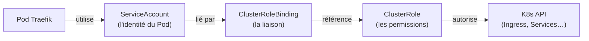
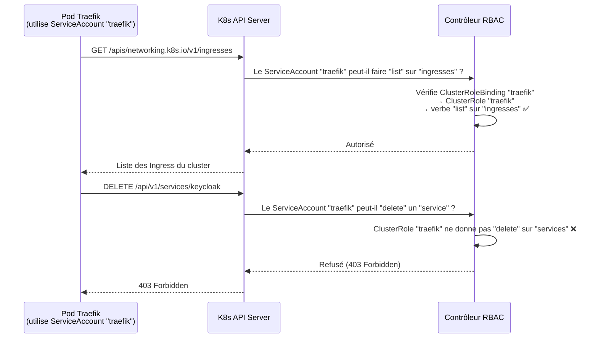
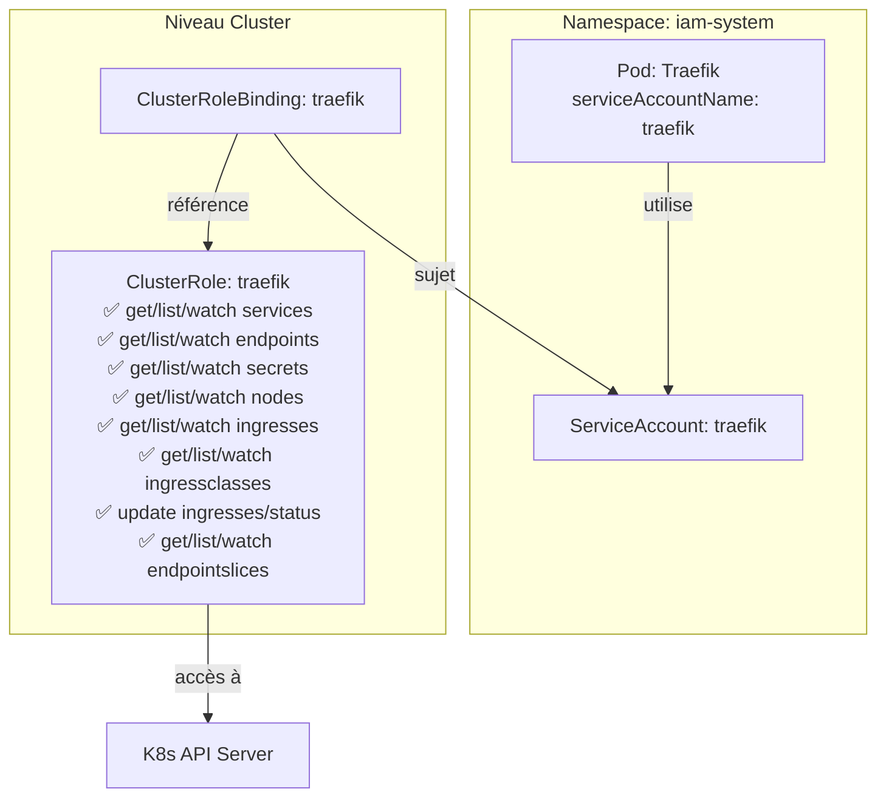

# Module 07 — RBAC et ServiceAccount

## Pourquoi des permissions dans K8s ?

Par défaut, les Pods n'ont aucun droit sur l'API Kubernetes. Ils ne peuvent pas lire les Ingress, les Services, ou d'autres ressources du cluster.

Mais **Traefik a besoin de lire l'API K8s** pour faire son travail : il doit surveiller les objets `Ingress`, `Service` et `Endpoints` pour savoir où router le trafic.

Sans permissions → Traefik ne peut pas lire les Ingress → le routage ne fonctionne pas.

**RBAC** (Role-Based Access Control) est le système de permissions de Kubernetes. Il définit **qui** peut faire **quoi** sur **quelles ressources**.

---

## Sommaire

- [Pourquoi des permissions dans K8s ?](#pourquoi-des-permissions-dans-k8s)
- [Les 4 objets RBAC](#les-4-objets-rbac)
- [Les fichiers RBAC de Traefik](#les-fichiers-rbac-de-traefik)
  - [1. ServiceAccount — `k8s/base/traefik/serviceaccount.yaml`](#1-serviceaccount-k8sbasetraefikserviceaccountyaml)
  - [2. ClusterRole — `k8s/base/traefik/clusterrole.yaml`](#2-clusterrole-k8sbasetraefikclusterroleyaml)
  - [3. ClusterRoleBinding — `k8s/base/traefik/clusterrolebinding.yaml`](#3-clusterrolebinding-k8sbasetraefikclusterrolebindingyaml)
- [Schéma — Flux des permissions Traefik](#schéma-flux-des-permissions-traefik)
- [Schéma — Architecture complète du RBAC Traefik](#schéma-architecture-complète-du-rbac-traefik)
- [Les autres services n'ont pas de RBAC](#les-autres-services-nont-pas-de-rbac)
- [Commandes utiles](#commandes-utiles)

---


## Les 4 objets RBAC



| Objet | Rôle |
|---|---|
| **ServiceAccount** | Identité attribuée à un Pod (comme un compte utilisateur pour un app) |
| **ClusterRole** | Liste des permissions (verbes sur des ressources) |
| **ClusterRoleBinding** | Associe une identité (ServiceAccount) à un rôle (ClusterRole) |
| **Role** | Comme ClusterRole, mais limité à un seul namespace |

> **Analogie** : le ServiceAccount c'est le badge d'un employé. Le ClusterRole c'est la liste des salles auxquelles il a accès. Le ClusterRoleBinding c'est le service RH qui donne le badge à l'employé.

---

## Les fichiers RBAC de Traefik

### 1. ServiceAccount — `k8s/base/traefik/serviceaccount.yaml`

```yaml
apiVersion: v1
kind: ServiceAccount
metadata:
  name: traefik              # ← Nom de l'identité
  namespace: iam-system      # ← Créé dans le namespace iam-system
  labels:
    app.kubernetes.io/name: traefik
    app.kubernetes.io/component: ingress-controller
```

C'est la carte d'identité de Traefik. Ce nom est référencé dans le Deployment :

```yaml
# Dans k8s/base/traefik/deployment.yaml
spec:
  serviceAccountName: traefik  # ← Le Pod Traefik utilise ce ServiceAccount
```

Sans cette ligne, le Pod utiliserait le ServiceAccount `default` du namespace, qui n'a aucune permission.

---

### 2. ClusterRole — `k8s/base/traefik/clusterrole.yaml`

```yaml
apiVersion: rbac.authorization.k8s.io/v1
kind: ClusterRole              # ← Permissions valables sur TOUT le cluster (pas juste un namespace)
metadata:
  name: traefik
rules:
  # Groupe "" = API core (Services, Endpoints, Secrets, Nodes)
  - apiGroups: [""]
    resources: ["services", "endpoints", "secrets", "nodes"]
    verbs: ["get", "list", "watch"]  # ← Lecture seule (pas de create, update, delete)

  # Groupe networking.k8s.io (Ingress, IngressClass)
  - apiGroups: ["networking.k8s.io"]
    resources: ["ingresses", "ingressclasses"]
    verbs: ["get", "list", "watch"]

  # Mise à jour du statut des Ingress (pour indiquer l'IP du LoadBalancer)
  - apiGroups: ["networking.k8s.io"]
    resources: ["ingresses/status"]
    verbs: ["update"]

  # Groupe discovery.k8s.io (EndpointSlices — successeur moderne de Endpoints)
  - apiGroups: ["discovery.k8s.io"]
    resources: ["endpointslices"]
    verbs: ["get", "list", "watch"]
```

**Pourquoi `ClusterRole` et pas `Role` ?**
Parce que Traefik doit surveiller les Ingress de **tous les namespaces** du cluster. Un `Role` n'a accès qu'à son propre namespace. Un `ClusterRole` a accès à l'ensemble du cluster.

**Les verbes :**
| Verbe | Équivalent HTTP |
|---|---|
| `get` | Lire une ressource spécifique |
| `list` | Lister toutes les ressources d'un type |
| `watch` | S'abonner aux changements en temps réel |
| `create` | Créer |
| `update` | Modifier |
| `delete` | Supprimer |

Traefik n'a que des droits de **lecture** (`get`, `list`, `watch`) sauf pour `ingresses/status` qu'il peut `update` (pour indiquer l'IP publique assignée).

---

### 3. ClusterRoleBinding — `k8s/base/traefik/clusterrolebinding.yaml`

```yaml
apiVersion: rbac.authorization.k8s.io/v1
kind: ClusterRoleBinding          # ← Liaison au niveau cluster
metadata:
  name: traefik
roleRef:
  apiGroup: rbac.authorization.k8s.io
  kind: ClusterRole
  name: traefik                   # ← Référence au ClusterRole "traefik"
subjects:
  - kind: ServiceAccount
    name: traefik                 # ← Référence au ServiceAccount "traefik"
    namespace: iam-system         # ← Dans le namespace iam-system
```

Ce fichier dit : « Le ServiceAccount `traefik` (dans `iam-system`) obtient toutes les permissions définies dans le ClusterRole `traefik`. »

---

## Schéma — Flux des permissions Traefik



---

## Schéma — Architecture complète du RBAC Traefik



---

## Les autres services n'ont pas de RBAC

Keycloak, PostgreSQL et Redis n'ont **pas** de ServiceAccount ni de ClusterRole. Pourquoi ?

Parce qu'ils n'ont pas besoin d'interagir avec l'API Kubernetes. Ils font leur travail de façon autonome :
- PostgreSQL stocke des données
- Redis met en cache des sessions
- Keycloak gère l'authentification

Seul Traefik a besoin de « parler » à K8s pour lire les règles de routage.

---

## Commandes utiles

```bash
# Voir les ServiceAccounts
kubectl get serviceaccounts -n iam-system

# Voir les ClusterRoles
kubectl get clusterroles | grep traefik

# Voir les ClusterRoleBindings
kubectl get clusterrolebindings | grep traefik

# Vérifier les permissions d'un ServiceAccount (auth can-i)
kubectl auth can-i list ingresses \
  --as=system:serviceaccount:iam-system:traefik

kubectl auth can-i delete services \
  --as=system:serviceaccount:iam-system:traefik
# → no (refusé, comme attendu)

# Voir les événements RBAC (si Traefik est refusé)
kubectl get events -n iam-system | grep Forbidden
```

---

> **Prochaine étape →** [Module 08 — Kustomize : base et overlays](./08-kustomize.md)
