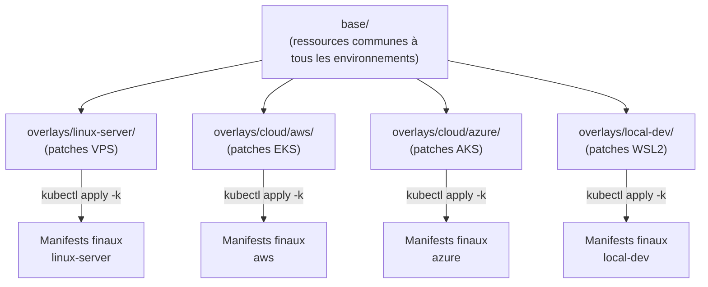
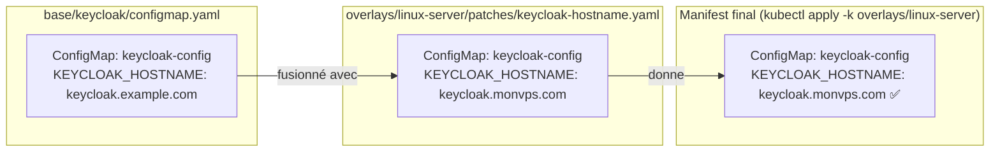
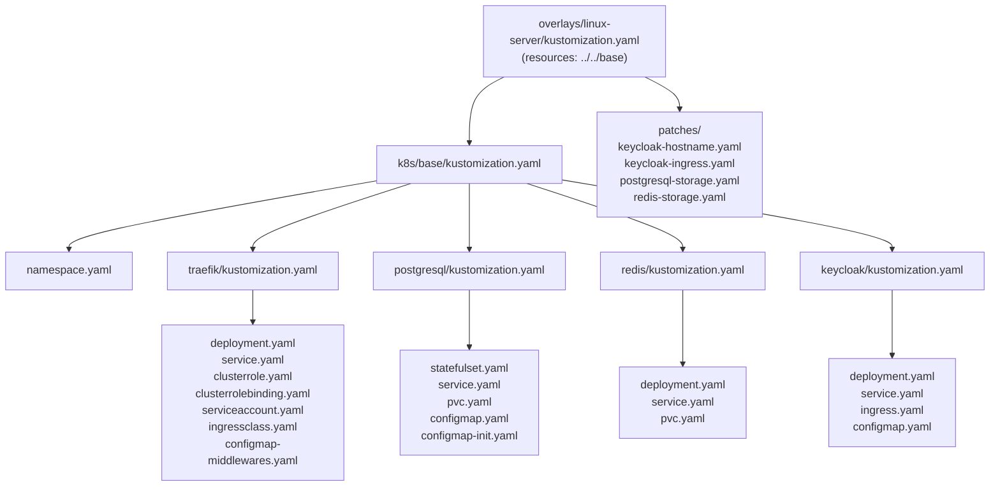

# Module 08 — Kustomize : base et overlays

## Le problème sans Kustomize

Tu as une plateforme Keycloak à déployer sur 3 environnements : ton VPS Linux, Azure, et AWS. Ce qui change entre les environnements :
- Le hostname Keycloak (`keycloak.monvps.com`, `keycloak.azure.com`…)
- La StorageClass des disques (`local-path`, `managed-csi`, `gp2`)

**Sans Kustomize**, tu as 3 options, toutes mauvaises :
1. Copier-coller tous tes YAML 3 fois → 3x de maintenance
2. Mettre des `if/else` dans tes YAML → ça n'existe pas en YAML
3. Utiliser des scripts `sed` pour remplacer les valeurs → fragile et illisible

**Avec Kustomize**, tu écris les ressources **une seule fois** dans `base/`, et tu ne définis dans chaque overlay **que ce qui change**.

---

## Sommaire

- [Le problème sans Kustomize](#le-problème-sans-kustomize)
- [Comment ça marche](#comment-ça-marche)
- [Le fichier kustomization.yaml](#le-fichier-kustomizationyaml)
  - [Base — `k8s/base/kustomization.yaml`](#base-k8sbasekustomizationyaml)
  - [Overlay linux-server — `k8s/overlays/linux-server/kustomization.yaml`](#overlay-linux-server-k8soverlayslinux-serverkustomizationyaml)
  - [Overlay cloud/aws — `k8s/overlays/cloud/aws/kustomization.yaml`](#overlay-cloudaws-k8soverlayscloudawskustomizationyaml)
- [Les patches — comment ça fonctionne](#les-patches-comment-ça-fonctionne)
  - [Patch de hostname — `linux-server/patches/keycloak-hostname.yaml`](#patch-de-hostname-linux-serverpatcheskeycloak-hostnameyaml)
  - [Patch de stockage — `linux-server/patches/postgresql-storage.yaml`](#patch-de-stockage-linux-serverpatchespostgresql-storageyaml)
  - [Patch d'args Keycloak — `local-dev/patches/keycloak-args.yaml`](#patch-dargs-keycloak-local-devpatcheskeycloak-argsyaml)
- [Schéma — Fusion base + overlay pour Keycloak](#schéma-fusion-base-overlay-pour-keycloak)
- [Schéma — Arbre complet des fichiers Kustomize](#schéma-arbre-complet-des-fichiers-kustomize)
- [Commandes utiles](#commandes-utiles)
- [Résumé : ce qui change par environnement](#résumé-ce-qui-change-par-environnement)

---


## Comment ça marche



Kustomize **fusionne** les ressources de `base/` avec les patches de l'overlay pour produire les manifests finaux. Aucune copie-coller, aucun template.

---

## Le fichier kustomization.yaml

Chaque dossier qui est géré par Kustomize doit avoir un fichier `kustomization.yaml`. C'est lui qui dit à Kustomize quoi inclure et comment le modifier.

### Base — `k8s/base/kustomization.yaml`

```yaml
apiVersion: kustomize.config.k8s.io/v1beta1
kind: Kustomization

namespace: iam-system       # ← Appliqué à toutes les ressources listées ci-dessous

resources:
  - namespace.yaml          # ← Le namespace lui-même
  - traefik                 # ← Dossier : lit traefik/kustomization.yaml
  - postgresql              # ← Dossier : lit postgresql/kustomization.yaml
  - redis                   # ← Dossier : lit redis/kustomization.yaml
  - keycloak                # ← Dossier : lit keycloak/kustomization.yaml
```

### Overlay linux-server — `k8s/overlays/linux-server/kustomization.yaml`

```yaml
apiVersion: kustomize.config.k8s.io/v1beta1
kind: Kustomization

# Overlay VPS bare metal (Hetzner / OVH / tout Linux avec k3s)

resources:
  - ../../base              # ← Inclut toute la base

patches:                    # ← Liste des modifications à appliquer par-dessus
  - path: patches/postgresql-storage.yaml   # ← Patch storageClassName
  - path: patches/redis-storage.yaml
  - path: patches/keycloak-hostname.yaml    # ← Patch hostname
  - path: patches/keycloak-ingress.yaml     # ← Patch host de l'Ingress
```

### Overlay cloud/aws — `k8s/overlays/cloud/aws/kustomization.yaml`

```yaml
apiVersion: kustomize.config.k8s.io/v1beta1
kind: Kustomization

# Overlay Elastic Kubernetes Service (EKS)

resources:
  - ../../../base           # ← Remonte 3 niveaux pour atteindre base/

patches:
  - path: patches/postgresql-storage.yaml   # ← storageClassName: gp2
  - path: patches/redis-storage.yaml
  - path: patches/keycloak-hostname.yaml    # ← Hostname AWS
```

---

## Les patches — comment ça fonctionne

Un patch est un fichier YAML **partiel**. Kustomize l'applique par-dessus la ressource correspondante dans `base/`, en fusionnant uniquement les champs spécifiés.

### Patch de hostname — `linux-server/patches/keycloak-hostname.yaml`

```yaml
apiVersion: v1
kind: ConfigMap
metadata:
  name: keycloak-config     # ← Identifie quel ConfigMap modifier (même namespace + même nom)
  namespace: iam-system
data:
  KEYCLOAK_HOSTNAME: keycloak.example.com  # ← Remplace cette valeur dans le ConfigMap de base
```

**Ce que Kustomize fait :**
- Prend le ConfigMap `keycloak-config` de `base/keycloak/configmap.yaml`
- Remplace `KEYCLOAK_HOSTNAME` par la valeur du patch
- Le résultat final contient la valeur du patch, pas celle de la base

### Patch de stockage — `linux-server/patches/postgresql-storage.yaml`

```yaml
apiVersion: v1
kind: PersistentVolumeClaim
metadata:
  name: postgresql-data      # ← Identifie quel PVC modifier
  namespace: iam-system
spec:
  storageClassName: local-path  # ← Ajoute ce champ (absent dans la base)
```

La base n'a pas de `storageClassName` (commenté). L'overlay l'ajoute pour cet environnement.

### Patch d'args Keycloak — `local-dev/patches/keycloak-args.yaml`

```yaml
apiVersion: apps/v1
kind: Deployment
metadata:
  name: keycloak             # ← Identifie quel Deployment modifier
  namespace: iam-system
spec:
  template:
    spec:
      containers:
        - name: keycloak
          args: ["start-dev"]              # ← Mode dev (pas de TLS requis)
          env:
            - name: KC_HOSTNAME_STRICT_HTTPS
              value: "false"               # ← Variable ajoutée uniquement en local-dev
```

Ce patch modifie en profondeur un Deployment — il change les `args` et ajoute une variable d'environnement. Kustomize fusionne intelligemment les listes.

---

## Schéma — Fusion base + overlay pour Keycloak



---

## Schéma — Arbre complet des fichiers Kustomize



---

## Commandes utiles

```bash
# Prévisualiser les manifests finaux SANS déployer (très utile pour debug)
kubectl kustomize k8s/overlays/linux-server/
kubectl kustomize k8s/overlays/local-dev/
kubectl kustomize k8s/overlays/cloud/aws/

# Déployer un overlay
kubectl apply -k k8s/overlays/linux-server/

# Supprimer tout ce qu'un overlay a déployé
kubectl delete -k k8s/overlays/linux-server/

# Valider avec kubeconform (outil de validation des schemas K8s)
kubectl kustomize k8s/overlays/linux-server/ | kubeconform -strict -
```

Le script `deploy-infra.sh` du projet encapsule la commande `kubectl apply -k` avec les bons arguments :

```bash
./scripts/deploy-infra.sh --env linux-server
# → Exécute : kubectl apply -k k8s/overlays/linux-server/
```

---

## Résumé : ce qui change par environnement

| Ce qui change | linux-server | local-dev | cloud/azure | cloud/aws |
|---|---|---|---|---|
| `storageClassName` PG | `local-path` | `local-path` | `managed-csi` | `gp2` |
| `storageClassName` Redis | `local-path` | `local-path` | `managed-csi` | `gp2` |
| `KEYCLOAK_HOSTNAME` | ton domaine | `keycloak.local` | domaine Azure | domaine AWS |
| Ingress host | ton domaine | `keycloak.local` | domaine Azure | domaine AWS |
| Mode Keycloak | `start` | `start-dev` | `start` | `start` |
| `KC_HOSTNAME_STRICT_HTTPS` | non défini | `false` | non défini | non défini |

Tout le reste est **identique** — les images Docker, les ports, les ressources CPU/mémoire, les probes, les Services, le RBAC…

---

> **Prochaine étape →** [Module 09 — Architecture complète](./09-architecture-complete.md)
