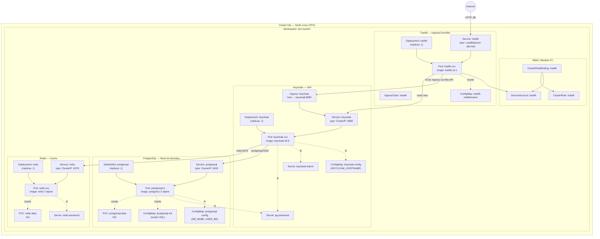
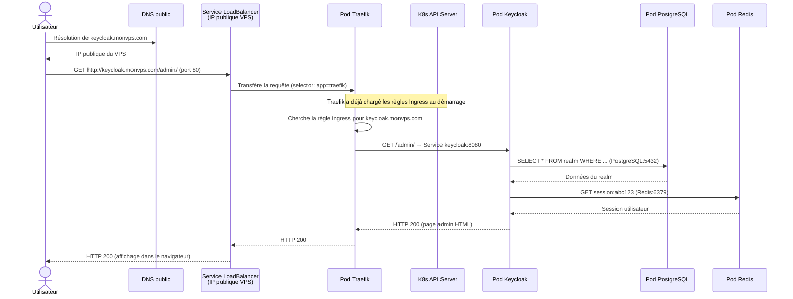
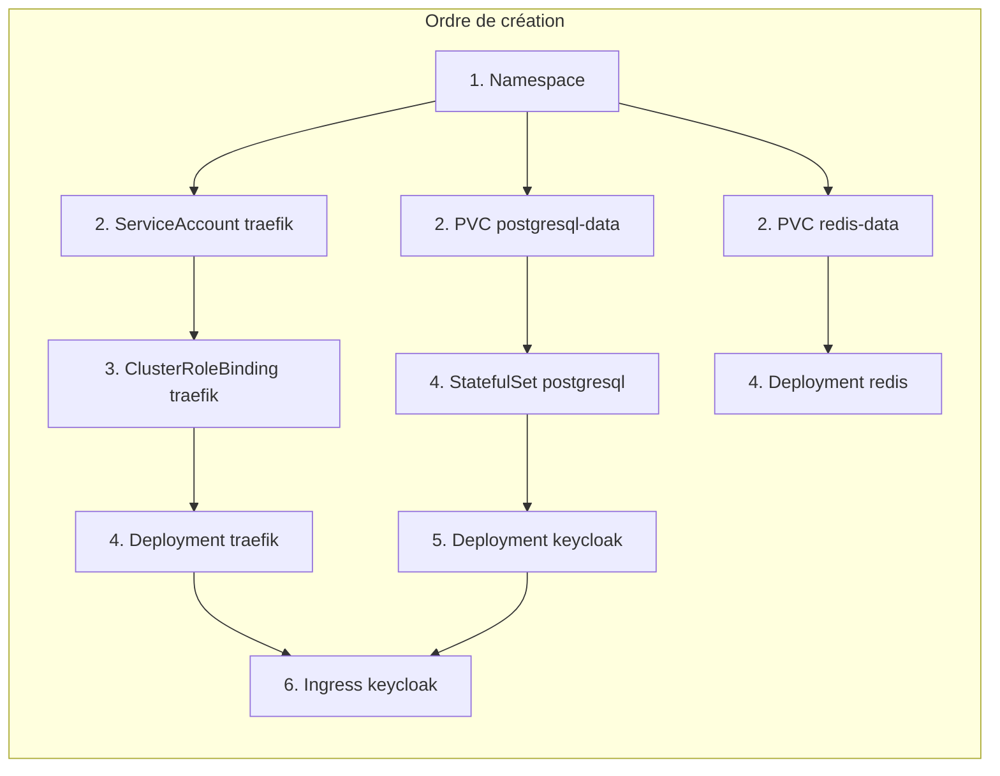

# Module 09 — Architecture complète

Ce module synthétise tout ce que tu as appris. On va lire l'architecture de ce projet de bout en bout, en partant d'une requête HTTP jusqu'aux données stockées sur disque.

---

## Sommaire

- [Vue d'ensemble : tous les objets K8s du projet](#vue-densemble-tous-les-objets-k8s-du-projet)
- [Flux complet d'une requête HTTP](#flux-complet-dune-requête-http)
- [Séquence de démarrage du cluster](#séquence-de-démarrage-du-cluster)
- [Carte des dépendances entre objets](#carte-des-dépendances-entre-objets)
- [Récapitulatif : chaque fichier YAML et son rôle](#récapitulatif-chaque-fichier-yaml-et-son-rôle)
- [Les 3 Secrets qui ne sont pas dans Git](#les-3-secrets-qui-ne-sont-pas-dans-git)
- [Commandes de diagnostic complètes](#commandes-de-diagnostic-complètes)
- [Félicitations !](#félicitations)
- [Index du cours](#index-du-cours)

---


## Vue d'ensemble : tous les objets K8s du projet



---

## Flux complet d'une requête HTTP

Trace le chemin d'un utilisateur qui ouvre `http://keycloak.monvps.com/admin/` :



---

## Séquence de démarrage du cluster

Quand tu exécutes `./scripts/deploy-infra.sh --env linux-server`, voici l'ordre dans lequel les composants deviennent opérationnels :

```mermaid
gantt
    title Séquence de démarrage (temps approximatif)
    dateFormat  ss
    axisFormat %Ss

    section Infrastructure
    Namespace iam-system créé     : 00, 2s
    PVC postgresql-data provisionné : 01, 5s
    PVC redis-data provisionné    : 01, 5s

    section Traefik
    Pod Traefik démarre           : 03, 5s
    readinessProbe /ping passe    : 08, 2s
    Service LoadBalancer actif    : 10, 1s

    section Base de données
    Pod PostgreSQL démarre        : 06, 20s
    pg_isready passe              : 26, 2s

    section Cache
    Pod Redis démarre             : 06, 10s
    redis-cli ping passe          : 16, 2s

    section IAM
    initContainer wait-for-postgresql : 06, 25s
    Pod Keycloak démarre          : 31, 60s
    /health/ready passe           : 91, 5s
    Keycloak accessible           : 96, 1s
```



**Ordre de dépendance :**
1. **PVC** → doit exister avant les Pods qui les montent
2. **Traefik** → indépendant, peut démarrer en parallèle de PostgreSQL/Redis
3. **PostgreSQL** → doit être prêt avant Keycloak (initContainer)
4. **Redis** → indépendant de Keycloak (mais Keycloak ne plante pas si Redis est absent)
5. **Keycloak** → démarre en dernier, dépend de PostgreSQL

---

## Carte des dépendances entre objets



---

## Récapitulatif : chaque fichier YAML et son rôle

| Fichier | Type K8s | Rôle |
|---|---|---|
| `base/namespace.yaml` | Namespace | Crée l'espace isolé `iam-system` |
| `base/traefik/serviceaccount.yaml` | ServiceAccount | Identité de Traefik |
| `base/traefik/clusterrole.yaml` | ClusterRole | Permissions de lecture sur l'API K8s |
| `base/traefik/clusterrolebinding.yaml` | ClusterRoleBinding | Lie le ServiceAccount au ClusterRole |
| `base/traefik/ingressclass.yaml` | IngressClass | Déclare Traefik comme IngressController |
| `base/traefik/configmap-middlewares.yaml` | ConfigMap | Config Traefik (middleware strip-hsts) |
| `base/traefik/deployment.yaml` | Deployment | Fait tourner le Pod Traefik |
| `base/traefik/service.yaml` | Service (LoadBalancer) | Expose Traefik sur Internet (:80/:443) |
| `base/postgresql/configmap.yaml` | ConfigMap | Nom DB et utilisateur PostgreSQL |
| `base/postgresql/configmap-init.yaml` | ConfigMap | Scripts SQL d'initialisation |
| `base/postgresql/pvc.yaml` | PVC | Réserve 5 Go de stockage pour PostgreSQL |
| `base/postgresql/statefulset.yaml` | StatefulSet | Fait tourner le Pod PostgreSQL |
| `base/postgresql/service.yaml` | Service (ClusterIP) | Adresse DNS stable `postgresql:5432` |
| `base/redis/pvc.yaml` | PVC | Réserve 1 Go de stockage pour Redis |
| `base/redis/deployment.yaml` | Deployment | Fait tourner le Pod Redis |
| `base/redis/service.yaml` | Service (ClusterIP) | Adresse DNS stable `redis:6379` |
| `base/keycloak/configmap.yaml` | ConfigMap | Hostname Keycloak (patché par overlay) |
| `base/keycloak/deployment.yaml` | Deployment | Fait tourner le Pod Keycloak |
| `base/keycloak/service.yaml` | Service (ClusterIP) | Adresse interne `keycloak:8080` |
| `base/keycloak/ingress.yaml` | Ingress | Règle de routage domaine → keycloak:8080 |
| `overlays/*/kustomization.yaml` | Kustomization | Pointe sur base/ + liste les patches |
| `overlays/*/patches/*.yaml` | Patches Kustomize | Surcharge le hostname, la StorageClass, les args |

---

## Les 3 Secrets qui ne sont pas dans Git

Ces objets K8s sont créés **manuellement** sur le cluster, jamais commités :

| Secret | Consommé par | Usage |
|---|---|---|
| `pg-password` | PostgreSQL + Keycloak | Mot de passe DB |
| `redis-password` | Redis | Mot de passe cache |
| `keycloak-admin` | Keycloak | Compte admin initial |

---

## Commandes de diagnostic complètes

```bash
# Vue d'ensemble de tout ce qui tourne
kubectl get all -n iam-system

# Vérifier que tout est Ready
kubectl get pods -n iam-system
# Résultat attendu (tous Running 1/1) :
# NAME                        READY   STATUS    RESTARTS
# traefik-xxx                 1/1     Running   0
# postgresql-0                1/1     Running   0
# redis-xxx                   1/1     Running   0
# keycloak-xxx                1/1     Running   0

# Vérifier le routage Ingress
kubectl get ingress -n iam-system

# Vérifier le stockage
kubectl get pvc -n iam-system
# Résultat attendu (Bound = disque prêt) :
# NAME              STATUS   CAPACITY
# postgresql-data   Bound    5Gi
# redis-data        Bound    1Gi

# Vérifier les Services
kubectl get services -n iam-system

# Diagnostiquer un Pod qui ne démarre pas
kubectl describe pod -n iam-system <nom-du-pod>
kubectl logs -n iam-system <nom-du-pod> --previous  # logs avant le dernier crash

# Redémarrer toute la plateforme (sans perte de données)
./scripts/restart-infra.sh --env linux-server

# Réinitialiser TOUT (destructif — perte des données !)
./scripts/reset-infra.sh --env linux-server --yes
```

---

## Félicitations !

Tu as maintenant une compréhension complète de l'architecture Kubernetes de ce projet. Voici ce que tu sais :

- **Namespace** — isoler les ressources dans `iam-system`
- **Pods / Deployments / StatefulSets** — faire tourner les 4 services
- **Services** — réseau interne stable (ClusterIP) et exposition externe (LoadBalancer)
- **Ingress + Traefik** — routage HTTP par domaine
- **ConfigMaps + Secrets** — configuration et données sensibles
- **PVC** — stockage persistant pour PostgreSQL et Redis
- **RBAC** — permissions de Traefik sur l'API K8s
- **Kustomize** — une seule base, des overlays par environnement

---

## Index du cours

| Module | Sujet |
|---|---|
| [00 — Introduction](./00-introduction.md) | C'est quoi K8s, k3s, l'architecture globale |
| [01 — Namespace](./01-namespace.md) | Isolation des ressources |
| [02 — Pods, Deployments, StatefulSets](./02-pods-deployments-statefulsets.md) | Faire tourner les conteneurs |
| [03 — Services et réseau](./03-services-reseau.md) | Réseau interne K8s, DNS |
| [04 — Ingress et Traefik](./04-ingress-traefik.md) | Exposition vers l'extérieur |
| [05 — ConfigMaps et Secrets](./05-configmaps-secrets.md) | Configuration et données sensibles |
| [06 — Stockage PVC](./06-stockage-pvc.md) | Persistance des données |
| [07 — RBAC et ServiceAccount](./07-rbac-serviceaccount.md) | Permissions K8s |
| [08 — Kustomize](./08-kustomize.md) | Base et overlays multi-environnements |
| [09 — Architecture complète](./09-architecture-complete.md) | Synthèse et vue d'ensemble |
