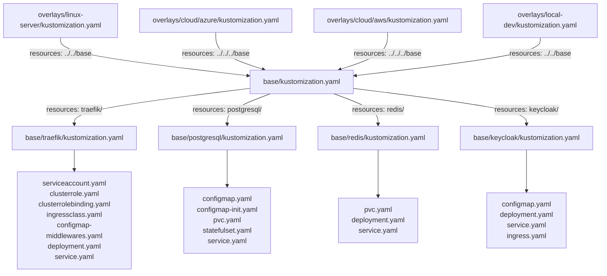
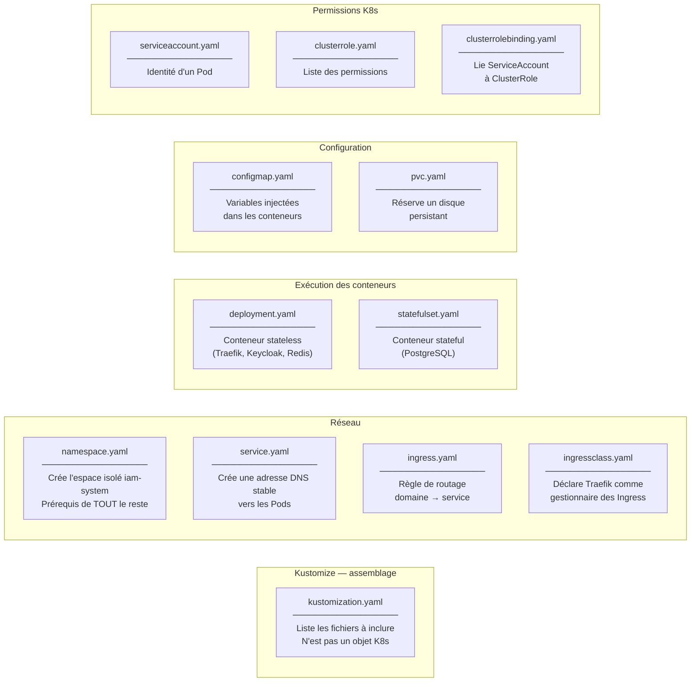
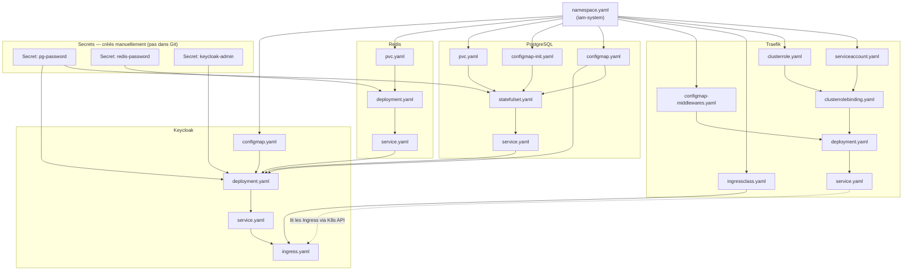
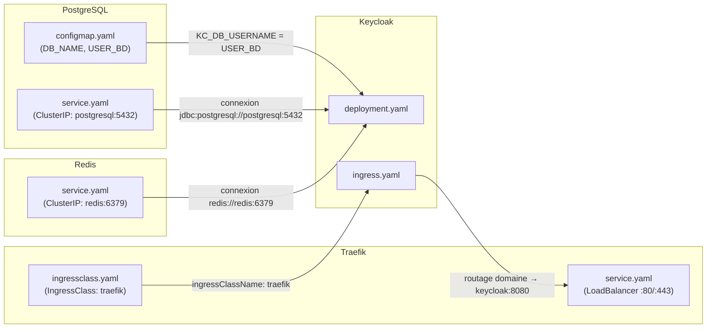
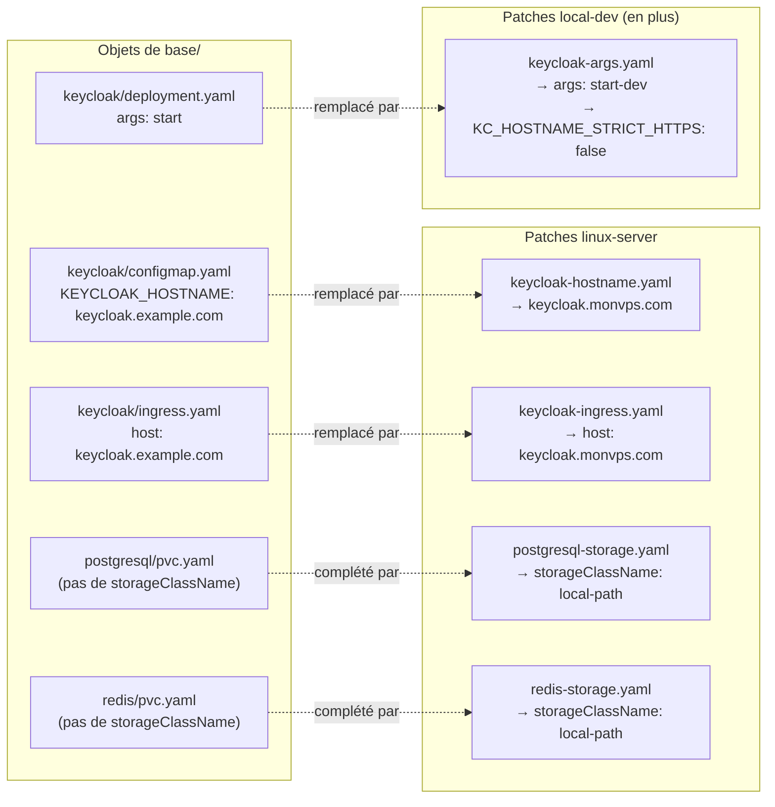

# Kubernetes — Manifests et dépendances

---

## Sommaire

- [Pourquoi autant de fichiers YAML différents ?](#pourquoi-autant-de-fichiers-yaml-différents)
- [Pourquoi un ConfigMap plutôt que les valeurs en dur ?](#pourquoi-un-configmap-plutôt-que-les-valeurs-en-dur)
- [Injection de variables — `valueFrom` et résolution au démarrage](#injection-de-variables-valuefrom-et-résolution-au-démarrage)
- [Hiérarchie Kustomize — qui inclut qui](#hiérarchie-kustomize-qui-inclut-qui)
- [Responsabilité de chaque type de fichier](#responsabilité-de-chaque-type-de-fichier)
- [Dépendances entre objets K8s](#dépendances-entre-objets-k8s)
- [Dépendances croisées entre services](#dépendances-croisées-entre-services)
- [Ce que les overlays patchent](#ce-que-les-overlays-patchent)
- [Ordre de création au déploiement](#ordre-de-création-au-déploiement)

---


## Pourquoi autant de fichiers YAML différents ?

Dans `k8s/base/postgresql/` on trouve :

```
postgresql/
├── configmap.yaml
├── configmap-init.yaml
├── statefulset.yaml
├── service.yaml
├── pvc.yaml
└── kustomization.yaml
```

Pourquoi 6 fichiers ? Chaque fichier crée un **objet K8s différent** qui fait **un seul travail**.
Ils ne sont pas interchangeables — ils se complètent.

| Fichier | Objet K8s | Son seul rôle |
|---|---|---|
| `statefulset.yaml` | StatefulSet | Faire tourner le conteneur PostgreSQL |
| `service.yaml` | Service | Créer une adresse réseau stable `postgresql:5432` |
| `pvc.yaml` | PVC | Réserver un disque de 5 Go |
| `configmap.yaml` | ConfigMap | Stocker des variables de configuration |
| `configmap-init.yaml` | ConfigMap | Stocker des scripts SQL à exécuter au démarrage |
| `kustomization.yaml` | Kustomization | Dire à Kustomize quoi inclure dans ce dossier |

Supprimer l'un d'eux, c'est supprimer une fonction entière.

---

## Pourquoi un ConfigMap plutôt que les valeurs en dur ?

Techniquement, tu peux écrire les valeurs directement dans le StatefulSet :

```yaml
# statefulset.yaml SANS ConfigMap
containers:
  - name: postgresql
    env:
      - name: POSTGRES_DB
        value: kc_db      # ← valeur écrite en dur ici
      - name: POSTGRES_USER
        value: admin
```

Mais dans ce projet, `kc_db` est nécessaire dans **deux conteneurs différents** : PostgreSQL ET Keycloak.

**Sans ConfigMap :** la valeur est dupliquée dans `statefulset.yaml` ET `deployment.yaml` de Keycloak.
Renommer la base = modifier **deux fichiers**.

**Avec ConfigMap :** la valeur est à **un seul endroit**. Les deux conteneurs la lisent via `valueFrom` :

```yaml
env:
  - name: POSTGRES_DB
    valueFrom:
      configMapKeyRef:
        name: postgresql-config
        key: DB_NAME        # ← lu depuis le ConfigMap
```

Deuxième avantage : un overlay Kustomize peut patcher le ConfigMap seul pour changer le hostname
sans toucher au Deployment.

---

## Injection de variables — `valueFrom` et résolution au démarrage

Il y a deux façons d'injecter une valeur dans un pod. Les deux coexistent dans ce projet.

**Façon 1 — Valeur écrite directement :**

```yaml
env:
  - name: KC_DB_URL
    value: "jdbc:postgresql://postgresql:5432/keycloak"
```

**Façon 2 — Valeur lue depuis un Secret ou ConfigMap :**

```yaml
env:
  - name: KC_DB_PASSWORD
    valueFrom:
      secretKeyRef:
        name: pg-password      ← nom de l'objet Secret K8s
        key: password

  - name: KC_DB_URL
    valueFrom:
      configMapKeyRef:
        name: keycloak-config
        key: KC_DB_URL
```

**Important :** ce n'est pas Kustomize qui résout les `valueFrom`. C'est **k3s lui-même**
au moment où le pod démarre. Si le Secret `pg-password` n'existe pas → le pod reste bloqué en `Pending`.
C'est pourquoi les secrets doivent être créés **avant** le déploiement.

---

## Hiérarchie Kustomize — qui inclut qui

Quand tu exécutes `kubectl apply -k overlays/linux-server/`, Kustomize lit cette chaîne :



---

## Responsabilité de chaque type de fichier



---

## Dépendances entre objets K8s



---

## Dépendances croisées entre services

Keycloak dépend des trois autres services :



---

## Ce que les overlays patchent

Les overlays ne créent pas de nouveaux objets — ils **modifient** des champs précis des objets de base.



---

## Ordre de création au déploiement

K8s crée les objets dans cet ordre logique :

```
1. Namespace (iam-system)
      ↓
2. ServiceAccount + ClusterRole + ClusterRoleBinding (RBAC Traefik)
   ConfigMaps (postgresql-config, keycloak-config, traefik-middlewares, postgresql-init)
   IngressClass (traefik)
   PVCs (postgresql-data, redis-data)
      ↓
3. StatefulSet PostgreSQL   (attend : ConfigMaps + PVC + Secret pg-password)
   Deployment Redis          (attend : PVC + Secret redis-password)
   Deployment Traefik        (attend : ServiceAccount + ConfigMap middlewares)
      ↓
4. Services (postgresql, redis, traefik, keycloak)
      ↓
5. Deployment Keycloak       (attend : Service postgresql + Service redis + Secrets)
      ↓
6. Ingress keycloak          (attend : Service keycloak + IngressClass traefik)
```
